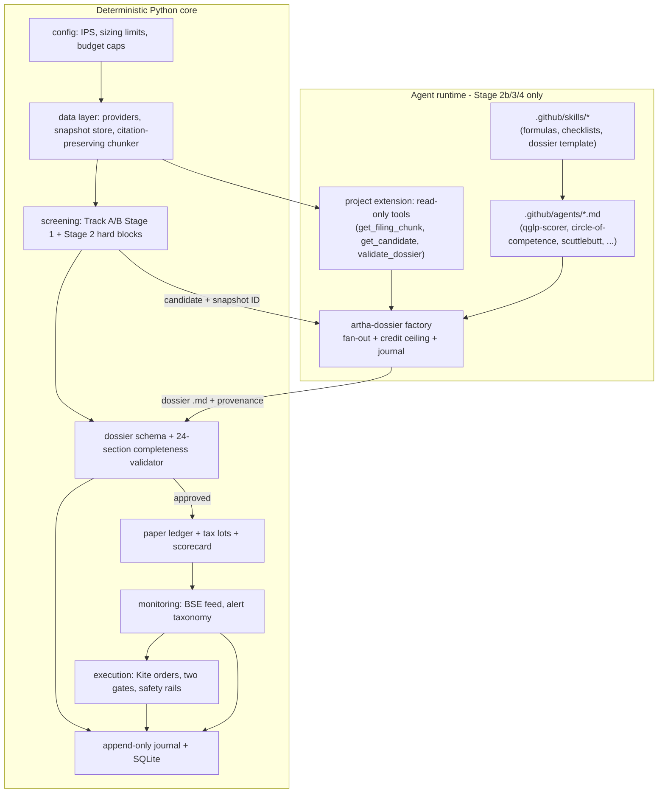
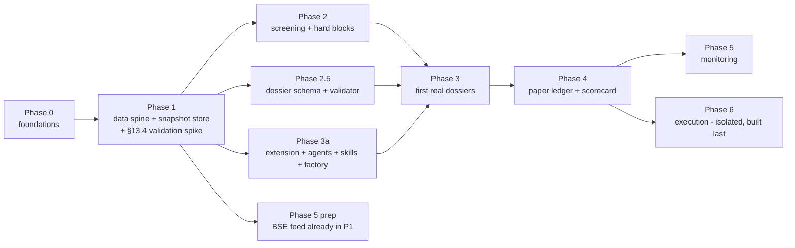

# Artha — Implementation Architecture

**Purpose of this document:** answer plan.md §16's open questions, define the build sequence, and fix how Copilot's own agent/subagent/factory tooling slots into Artha's runtime — so the actual implementation plan (created next, when you attach this doc + plan.md) has no open architectural decisions left to make mid-build.

**Key decision this document is built around (confirmed with you):** Stage 3 (deep-dive extraction) and Stage 4 (dossier assembly) run on **Claude Opus/Sonnet via the GitHub Copilot app** — not a direct Anthropic/OpenAI API integration in Python. This resolves §16 Q2 and reshapes the architecture below: Copilot custom agents, skill files, a project extension, and an **Agent Factory** are not developer conveniences here — they are the Stage 3/4 production runtime.

---

## 1. §16 open questions — resolved

| # | Question | Resolution |
|---|---|---|
| 1 | Dossier storage | **Both.** Markdown files in git under `dossiers/<ticker>/<run_id>.md` (immutable, diffable, the artifact) + a SQLite `dossiers` table (queryable index: ticker, track, stage, scores, gate outcomes, FK to snapshot + factory run ID). |
| 2 | LLM orchestration | **Copilot custom agents + skills + an Agent Factory**, model = Claude Opus/Sonnet via the Copilot app. No direct LLM API calls in Python. Deterministic Python code stays responsible for data, screening, validation, ledger, and execution — the agent layer only ever *researches and writes*, never *decides or trades* (§8 below). |
| 3 | Scheduling | Stage 1/2 (cheap, deterministic) can run on a scheduled workflow (weekly). Stage 3/4 (expensive, Copilot-credit-metered) stays **on-demand, human-triggered per candidate** until real cost-per-dossier is known from the paper phase — do not auto-schedule the expensive stage first. |
| 4 | Review surface | Plain markdown dossiers, reviewed in the Copilot app / your editor / git diff. No separate web UI in Phases 0–4. Revisit only once the Phase 4 scorecard needs a dashboard, and only as a read-only view over the SQLite index. |
| 5 | Cost ceiling per run | Enforced natively via Agent Factory `limits.maxAiCredits` (+ `maxConcurrentSubagents`, `maxTotalSubagents`, `timeoutSeconds`) on the dossier factory. Honest caveat: this is a **soft, post-paid** ceiling per the factory docs, not a hard pre-check — log actual spend per dossier into SQLite regardless, so the cap is verified in practice, not just assumed. |
| 6 | Snapshot immutability | Content-addressable snapshot store (Phase 1) keyed by a snapshot ID; every dossier records **(snapshot ID, factory run ID, agent/skill commit SHA, model)** as its reproducibility tuple. Factory runs are durably journaled and resumable, which also gives cheap replay if a run is interrupted partway. |

---

## 2. Layered architecture



**Module layout** (unchanged from plan.md §11's phases, now with the agent harness called out as its own vertical):

```
artha/
  config/                 # IPS, benchmark, sizing limits, per-run budget config
  db/                     # SQLite schema + migrations
  journal/                # append-only journal writer
  data/                   # Phase 1
    providers/            # kite.py, eodhd.py, bse_feed.py, stockinsights.py, tijori.py
    snapshot.py           # content-addressable snapshot store (the reproducibility anchor)
    filings.py            # citation-preserving chunker: (doc_id, page, text) -> chunk store
  screening/              # Phase 2 — plain Python, deterministic, fully unit-testable
    track_a.py, track_b.py, hard_blocks.py   # incl. Greenblatt rank gate, Pabrai asymmetry gate
  dossier/                # Phase 2.5 — deterministic harness the agents write into
    schema.py             # the 24-section dossier data model
    validator.py          # completeness + citation-presence checker; rejects, doesn't warn
  ledger/                 # Phase 4
    positions.py, tax_lots.py, scorecard.py
  monitoring/             # Phase 5
    alerts.py, triggers.py
  execution/              # Phase 6 — never imports anything from the agent runtime
    kite_orders.py, gates.py, safety.py
  cli/                    # artha screen | artha research <ticker> | artha review | artha order

.github/
  extensions/artha-tools/ # Phase 3a — read-only tool surface for the agents (see §4)
  agents/                 # Phase 3a — one agent per framework/extraction concern
  skills/                 # Phase 3a — reusable formulas/checklists, versioned like the dossier template
```

**Why pledging (§13.3a) belongs here too:** it's an LLM-verified Stage 2 item that fails closed. Implement it as a small, separate factory or a single `ctx.agent()` call gated behind the same extension tools — not a bespoke path — so there is one LLM substrate in the whole app, not two.

---

## 3. Build sequence

Deterministic core always precedes the agent layer, because the agents need a tool surface and a data contract to operate on — but several branches are independent once Phase 1 lands, and that's where parallelism (subagents, below) actually pays off.



- **Phase 0 and 1 are strictly sequential** and strictly first — they fix the config schema, SQLite schema, journal format, and snapshot/citation contract everything else depends on. Do not parallelize these; a wrong contract here is expensive to unwind later.
- **Once Phase 1 exists**, Phase 2 (screening), Phase 2.5 (dossier schema/validator), and Phase 3a (agent harness) are mutually independent — they only depend on Phase 1's data contract, not on each other. This is the natural parallelization point (see §5).
- **Phase 3 (first real dossiers)** needs all three of the above finished — it's where screening output meets the agent harness.
- **Phase 4 (ledger/scorecard)** only needs the dossier *schema* (buy-below price, position size fields) frozen, not working Stage 3 agents — so it can start alongside Phase 3a rather than waiting on it.
- **Phase 6 (execution)** is built last and stays structurally isolated: no import path from `execution/` to `.github/agents` or the factory. This is a safety property, not a convenience — no research agent should ever be one tool-call away from placing an order.

**On "should I build the app or the agents/skills first":** neither, strictly — build the thin deterministic core (Phase 0/1 + the dossier schema/validator) first, because it's what the agents will read from and write into. Building agents/skills before that exists has no contract to anchor them to and invites over-engineered, speculative tool definitions.

---

## 4. The agent harness (Phase 3a) — concrete design

1. **Project extension** (`.github/extensions/artha-tools/`, built per the extensions authoring guide) exposes a small, read-only tool surface: `get_filing_chunk(doc_id, page)`, `get_candidate(ticker, snapshot_id)`, `list_candidate_chunks(ticker, topic)`, `validate_dossier(draft)`. No write/order tools live here.
2. **Custom agents** (`.github/agents/*.md`), one per extraction concern that plan.md §6/§17 names as a dossier section — e.g. `qglp-scorer.md`, `circle-of-competence.md`, `scuttlebutt.md`, `magic-formula.md`, `davis-double-play.md`, `canslim-momentum.md` (Track B only). Each agent's system prompt encodes its own checklist/formula from §5 and §17, is restricted to the extension's read-only tools, and must cite `(doc_id, page)` for every factual claim — matching §6's dossier rule verbatim.
3. **Skills** (`.github/skills/`) hold the reusable, versioned procedures the agents call into (e.g. "how to compute ROIIC," "how to fill dossier §19"), so a formula changes in one place, not in every agent prompt that uses it.
4. **`artha-dossier` factory** (registered by the extension via `defineFactory`) is the orchestrator:
   - `args`: `{ ticker, snapshot_id, track }`.
   - `limits`: `maxConcurrentSubagents` (~5), `maxTotalSubagents` (~20, covering the 13 framework sections + 5 qualitative tasks + assembly/verification), `maxAiCredits` (the hard-ish cost ceiling from §16 Q5), `timeoutSeconds`.
   - Body: `pipeline` across the framework/extraction dimensions (each stage = one `ctx.agent(prompt, { agent: "<named-agent>", label, schema })` call, scoped to only the filing chunks that dimension needs — this *is* the context-management mechanism, see §6), then a **citation-verification pass** (a distinct-lens subagent re-checks each claim's cited chunk actually supports it — the "adversarial verify" pattern), then `ctx.step("assemble", ...)` calls the Python `validate_dossier` tool before writing the markdown file.
   - On completion: write `dossiers/<ticker>/<run_id>.md`, insert the SQLite index row with `(snapshot_id, run_id, agent/skill commit SHA, model)`, journal the decision.
   - If interrupted or credit-capped: `factories_manage` → `runs` finds the run, resume with `run_factory({ resumeFromRunId })` — journaled sections replay for free, matching §16 Q6's reproducibility goal.

**Caveat to carry forward honestly, in the spirit of plan.md's own rigor:** the Agent Factory API is explicitly documented as experimental, and `maxAiCredits` is a soft post-paid ceiling, not a hard pre-check. The citation-verification pass reduces but does not eliminate hallucination risk — plan.md's own line applies: "An LLM red-team is not independent evidence." Keep the deterministic `validate_dossier` gate (completeness + citation-presence, not truth) as the non-negotiable backstop regardless of how much agent-side verification is added.

---

## 5. When to use subagents

Two separate contexts — do not conflate them:

**A. Building Artha (this session and future ones, using the `task` tool):**
- **Use** for: the §13.4 EODHD/stockinsights/Tijori validation spike (an `explore`/`research` agent, since it's an isolated investigation with a clear yes/no output); implementing Phase 2 / Phase 2.5 / Phase 3a in parallel once Phase 1's data contract is frozen (three independent `general-purpose` agents, one per branch); a `code-review` or `security-review` pass specifically before Phase 6 ships, since that's the one phase touching live money.
- **Don't use** for: Phase 0/1 (sequential, contract-defining — do this yourself); the dossier template/schema design (§6's 24 sections interact with each other and need one holistic owner, not a split view); anything where the fix requires the full plan's nuance rather than a scoped slice.

**B. Artha's own runtime (Agent Factory, inside `artha-dossier`):**
- **Use** for: fanning out the 13 framework sections + 5 qualitative extraction tasks (each is genuinely independent given the same snapshot); adversarial citation verification (perspective-diverse: a different subagent re-checks each claim against its cited source); the pledging fail-closed check (§13.3a).
- **Don't use** for: Stage 1/2 screening (deterministic — no LLM judgment belongs there beyond the one pledging exception); Stage 6 execution (§7's two gates are human-only by design — no agent should be able to reach the order-placement tools, structurally, not just by convention).

---

## 6. Context management

**Runtime (inside the factory):** the fan-out pattern above *is* the context strategy — no single agent call ever receives a whole filing corpus. Each dimension's subagent gets only the chunks its extraction concern needs (via `get_filing_chunk`/`list_candidate_chunks`), keeps its own short context, and returns a small structured/text result that the factory accumulates. The assembly step operates on already-condensed section outputs, not raw filings.

**Build-time (this multi-week, 8-phase build):**
- **One session per phase** (or one per tightly-coupled phase pair), not one long-running session for the whole project. Phase boundaries in plan.md §11 are already natural session boundaries.
- **Persist decisions as short, committed docs** (an `docs/adr/NNN-*.md` per material decision, plus this architecture doc once finalized) so a new session rehydrates by reading a few files, not by replaying prior conversation history.
- **Treat committed code + passing tests as the source of truth**, not conversation memory — each phase's "Exit" criterion from §11 is the handoff artifact to the next session.
- **Use the `todos` table** (already reflected below) as the durable cross-session task list, so a new session can query "what's ready" instead of being told verbally.

---

## 7. Safety separation (non-negotiable)

- `execution/` has no import path to `.github/agents`, `.github/extensions/artha-tools`, or the factory. Enforced by module boundaries and worth a lint rule once Phase 6 starts.
- The agent extension's tools are read-only. No tool in `artha-tools` can place, modify, or cancel an order.
- Gate 1 (thesis approval) and Gate 2 (order confirmation) both stay human-typed actions in the CLI, per plan.md §7.1 — the factory's output is an input to Gate 1, never a bypass of it.

---

## 8. Risks and honest caveats

- Agent Factories are an experimental API — the orchestration design in §4 may need to change if the API changes before Phase 3a is built. Keep the fallback in mind: plain `task`-tool subagents from an interactively-driven session, run manually per candidate, produce the same dossier shape without the factory's credit/journaling guarantees.
- `maxAiCredits` is soft/post-paid — log actual per-dossier cost in SQLite from the first run, and revisit the sizing of the limit once real numbers exist (this is exactly the kind of thing the Phase "Paper" stage in §9 is for).
- Citation-checking subagents catch inconsistency between claim and cited source; they do not catch a source that is itself wrong or incomplete. This doesn't change plan.md §6's provenance rule — it's a reason to keep it.

---

## Todos (reflected in SQL for tracking)

1. Freeze this architecture doc + resolve any open questions you raise on review.
2. Phase 0 — foundations (config, SQLite schema, journal, secrets/keyring, `artha --version`).
3. Phase 1 — data spine, snapshot/citation store, §13.4 validation spike.
4. Phase 2 — screening + hard blocks (Track A/B Stage 1, Greenblatt/Pabrai gates).
5. Phase 2.5 — dossier schema + 24-section completeness validator.
6. Phase 3a — project extension, custom agents, skills, `artha-dossier` factory.
7. Phase 3 — first real dossiers end to end (screening → factory → validated markdown).
8. Phase 4 — paper ledger + scorecard (can start once dossier schema is frozen, in parallel with 6/7).
9. Phase 5 — monitoring + alert taxonomy.
10. Phase 6 — execution (Kite, two gates, safety rails) — built last, structurally isolated.
11. Phase 7 — annual re-underwriting process (reuses Phase 3a machinery).
