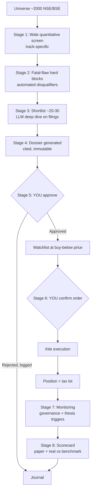

# Project Artha — Plan (v3)

> *Artha* — wealth pursued through sound, disciplined means.

**What this is:** an application that researches Indian equities, documents every investment decision to a reviewable standard, and places approved orders on Zerodha Kite — with investing discipline encoded as enforced guardrails rather than remembered intentions.

**What changed from v2:** v2 was *a manual investing practice with a little supporting software*. It explicitly forbade the three things you actually want: it banned automated order placement, banned the LLM from proposing stocks, and banned a market-wide screener. It also front-loaded 9–18 months of no-code manual work. This version inverts that: **the application is the deliverable.** The discipline from v2 survives — not as willpower, but as code.

**What has *not* changed:** the arithmetic in §2, the position limits, the evidence gate, and the stopping rules. Those were the parts of v2 that were right, and building software does not repeal them.

---

## 1. The four goals, stated precisely

| # | Your goal | How this plan delivers it | Honest caveat |
|---|---|---|---|
| 1 | Research and suggest stocks that **2x in 1–2 years**, or beat the index | Two-track research engine (§4): a compounder track and an asymmetric-bet track that explicitly hunts doubles | No process makes *each* pick 2x. The engine hunts asymmetry; the portfolio is judged vs the index (§2.5, §9) |
| 2 | **Place the order on Kite** once approved | Full execution path with a two-stage human approval gate (§7) | Legal and buildable — SEBI permits it (§12). No broker sandbox exists, so live-order testing needs care |
| 3 | **Document the entire research** for review before buying | The dossier is the product (§6). Every number carries a source citation; nothing reaches you undocumented | An LLM dossier is *evidence assembled*, not judgement. It can miss the omission that matters |
| 4 | Plan → **architecture** → implementation plan → build | This plan defines what and why, and fixes the decisions architecture depends on (§16) | — |

---

## 2. The honest numbers (preserved from v2, reframed)

The software changes *throughput and discipline*. It does not change the base rates.

### 2.1 What the app plausibly improves

- **Coverage** — screen ~2,000 listed companies instead of the ~20 you can read by hand.
- **Consistency** — the fatal-flaw checklist can never be skipped because it is a hard code block.
- **Detection speed** — governance red flags surface in days, not at the next annual report (§8).
- **Record honesty** — an append-only journal that cannot be quietly revised after the fact.

### 2.2 What it does not improve

Judgement about whether a business will still be winning in five years. SPIVA India: **84–94% of active large-cap funds trail their benchmark over 5 years**. Barber–Odean: **~10% of individuals beat the market long-run**. Those funds are full-time teams. A good pipeline moves you up that distribution; it does not exempt you from it.

**P(the sleeve beats its benchmark over 5 years): ~20–30%** — modestly better than v2's 15–25%, because coverage and discipline are genuinely worth something. Anyone quoting higher is selling.

### 2.3 Tax drag, and why 12 months is a hard line

Post-July-2024 rates: **STCG 20%** (held <12 months), **LTCG 12.5%** (held >12 months, ₹1.25L annual exemption).

| A position doubles… | Gross | Tax | Net gain |
|---|---|---|---|
| …and is sold at month 11 | +100% | 20% | **+80%** |
| …and is sold at month 13 | +100% | 12.5% | **+87.5%** |

Two months of patience is worth **7.5 percentage points** on a double. **Encoded rule: nothing is sold before 12 months unless the thesis is broken.** This is why the goal is framed as 1–2 years, and the engine should bias to the back half of that window.

### 2.4 The one that matters most: capping winners kills the strategy

The asymmetric track only works if winners are allowed to run past 2x. Two distributions of 10 bets over 2 years:

| Outcome shape | Result | 2-yr total | CAGR |
|---|---|---|---|
| **Winners capped at 2x** — 2 double, 3 up 25%, 3 down 10%, 2 down 40% | 165/10 | **+16.5%** | ~8% — *loses to the index* |
| **Winners allowed to run** — 1 up 4x, 2 double, 3 up 30%, 2 flat, 2 down 50% | 490/10 | **+49%** | ~22% — *beats it clearly* |

Same hit rate. The difference is entirely the sell rule. **So "2x" is a screening hypothesis, never a sell trigger.** This single insight drives §6's dossier spec and §7's sell rules — a naive implementation that books profit at 2x would systematically underperform.

### 2.5 The reframe on "2x in 1–2 years"

Individual Indian small/midcaps double in 1–2 years routinely — this is real, not fiction. What is fiction is a *portfolio* reliably compounding at that rate. So:

- **The engine's job:** find setups where 2x is *plausible* and the downside is *capped* — asymmetry, not certainty.
- **The scorecard's job:** judge the sleeve against the frozen benchmark post-tax over multi-year windows (§9).
- Individual doubles are the *mechanism*. Beating the index is the *measure*.

---

## 3. Product definition

A local-first Python application, run on your machine, that executes this pipeline:

**Design principles**
1. **Nothing reaches you undocumented.** No suggestion without a dossier.
2. **Two human gates.** Thesis approval, then order confirmation. Neither is skippable.
3. **Hard blocks are hard.** A disqualifier ends the analysis; there is no override flag.
4. **Append-only journal.** Including *deliberate inaction* — the decisions not to buy are the record's most honest part.
5. **Dry-run by default.** Live execution requires explicit, deliberate enabling.

---

## 4. The two tracks

Each track gets its own screens, dossier template, sizing rules, and **its own scorecard** — so you learn which one actually works rather than blending them into one unattributable number.

| | **Track A — Compounders** | **Track B — Asymmetric bets** |
|---|---|---|
| **Thesis shape** | Durable quality bought at a fair price | Earnings inflection, turnaround, cyclical upturn, re-rating, deleveraging |
| **Screen emphasis** | ROCE consistency, FCF/PAT reconciliation, low debt, earnings stability across a cycle | **Reported** inflection — earnings acceleration (QoQ/YoY), margin expansion, capex-cycle turn, debt reduction, depressed base, low institutional coverage. *Deliberately not estimate revisions* (§13.3b) |
| **Holding period** | 5+ years | 1–3 years |
| **Target** | Beat index over a decade | 2x, winners allowed to run past it |
| **Sizing** | 2–3% of investable assets | **1–1.5%** — tighter, higher variance |
| **Sleeve share** | ~60% of active sleeve | **~40% cap** |
| **Failure mode to guard** | Overpaying for quality; value-trap "compounders" | Value traps, accounting fraud, one-off earnings mistaken for inflection |
| **Sell rule** | Thesis broken; price far exceeds defensible value | Thesis broken; **never a mechanical 2x trim** (§2.4) |

**Cross-cutting hard limits** (apply to the whole sleeve): max ~25% in one name, ~30% in one sector, ~35% in small caps. No leverage, no F&O, no margin, no derivatives — ever.

---

## 5. The research pipeline

### 5.1 Universe & liquidity floor
NSE/BSE listed, with a minimum market cap and traded-volume floor so positions are exitable. Microcaps below the floor are excluded — not deprioritised, excluded.

### 5.2 Circle of competence
A written, machine-readable sector allowlist. Everything outside is filtered out before research spend. Plausibly in: IT services, SaaS, platforms, consumer businesses. Plausibly out: banks/NBFCs (leveraged black boxes), pharma (regulatory binaries), commodities. **Track B may relax sector limits only where the inflection is mechanically evident in the financials** — an explicit, logged exception, since turnarounds cluster in cyclicals.

### 5.3 Stage 1 — wide quantitative screen
Cheap, runs over the full universe, track-specific rule sets. Output: a few hundred names, ranked.

### 5.4 Stage 2 — fatal-flaw hard blocks
~15 disqualifying questions from v2, automated where the data allows. **Any "no" or "unknown" ends the analysis.** No score, no override:
- Does profit become cash, or does FCF chronically diverge from PAT?
- Promoter pledging, related-party transactions, auditor resignations?
- Can it survive its worst historical year without dilution?
- Single customer / regulator / input that can end it?
- Serial equity dilution?
- Can the business be explained in five sentences?
- What is the price already assuming, and is that plausible?

Questions the data cannot answer become **mandatory LLM-verified items** in Stage 3, flagged if unresolvable. **Promoter pledging starts here** — no affordable API exposes it as a structured field (§13.3a), so it is LLM-verified from shareholding-pattern filings and **fails closed** when it cannot be established.

### 5.5 Stage 3 — deep dive (the expensive stage)
On ~20–30 names: LLM reads annual reports, quarterly filings, concall transcripts and investor presentations. Extracts related-party transactions, auditor changes, contingent liabilities, segment trends; diffs this year's MD&A against last year's; red-teams the emerging thesis.

**Rules:** every extracted claim carries a **source citation (document + page)**. Uncited claims are defects and are dropped. The LLM must report **what it could not verify** — that list goes in the dossier. An LLM red-team is not independent evidence.

### 5.6 Stage 4 — the dossier (§6)

### 5.7 Patience
Approved theses sit on a watchlist at their buy-below price, often for months. **Inactivity is the intended state.** The app must never nudge you to act.

---

## 6. The dossier — this is the product (goal 3)

One markdown file per candidate, immutable once approved, versioned in git. **Mandatory sections:**

1. **Identity** — company, ticker, sector, track, date, pipeline run ID, data snapshot ID
2. **The business in five sentences** — if it can't be written, the analysis ends
3. **Why now** — the specific trigger or catalyst
4. **The three things that must be true**
5. **Financial evidence** — every figure with a source citation
6. **Fatal-flaw checklist** — each item, its evidence, pass/fail
7. **Valuation** — bear / base / bull with assumptions stated explicitly
8. **Buy-below price** and proposed position size with rationale
9. **Pre-mortem** — *it is two years on and this lost 60%: what happened?*
10. **Kill triggers** — machine-checkable wherever possible, wired into §8 monitoring
11. **What would make me add more**
12. **Disconfirming evidence** — mandatory; what argues *against* this. An empty section fails review
13. **Expected holding period** and the 12-month tax line (§2.3)
14. **Provenance** — model, prompt version, documents read, and **what could not be verified**

Sections 12 and 14 are the anti-self-deception mechanism. A dossier missing either is rejected by the tooling, not by your discipline.

---

## 7. Approval and execution (goal 2)

### 7.1 Two gates
- **Gate 1 — thesis approval.** You read the dossier and record APPROVED / REJECTED / DEFERRED with a reason. All three outcomes are journalled.
- **Gate 2 — order confirmation.** When price hits buy-below, the app proposes an order showing quantity, price, total value, resulting position size, and sleeve impact. **You confirm explicitly.** Nothing is ever sent without this.

Between the two gates, the app's only autonomous act is *watching a price*.

### 7.2 Execution safety
Kite Connect has **no sandbox — every order is live.** Therefore:
- **Dry-run mode is the default**, and is a persisted setting, not a CLI flag.
- First live order is a **single share** to validate the whole path end-to-end.
- Hard cap on maximum order value; orders rejected outside market hours.
- Idempotency keys so a retry can never double-send.
- Every fill reconciled against Kite holdings; mismatch halts the app.
- Kill switch that disables execution without touching research.
- Credentials in the OS keyring. Never in the repo, never in env files committed to git.

### 7.3 Sell discipline
No stop-losses — a falling price on an intact thesis is an opportunity. Sell only when the **thesis breaks**, price **far exceeds** defensible value, or a **materially better opportunity** exists with capital fully deployed. **No mechanical trim at 2x** (§2.4). Never average down on a broken thesis; adding to a sound one at a lower price is the entire point.

---

## 8. Monitoring — the highest-value automation

Alerts within days, not at the next annual report: auditor resignation, promoter pledge changes, credit rating downgrades, large related-party transactions, sudden promoter selling, regulatory action, insider-trading disclosures.

Plus **thesis-specific triggers** from each dossier's §10 — the app watches for the conditions you yourself said would prove you wrong. This is the piece a fund cannot replicate for your ten names, and it goes live **before** real capital does.

---

## 9. Evidence gate and scorecard (decision B)

**Benchmark, frozen before the first purchase and never changed:** a named Nifty 50 TR index fund plus one named factor fund (Momentum 30 or Quality 30), fixed weights, recorded by name. Time-weighted returns for skill, money-weighted for wealth, both post-tax including accrued liability on unrealised gains. Judged against each benchmark independently — beating one and losing the other is a loss.

**From day one the app paper-trades every recommendation**, with immutable timestamped dossiers. Because the engine generates evidence continuously, the gate is measured in months, not v2's seven years.

| Stage | Active allocation | Condition to advance |
|---|---|---|
| Paper | 0% | 20+ dossiers generated and reviewed; pipeline reproducible; scorecard engine tested |
| S1 | ~5% | IPS complete; benchmark frozen; monitoring live; execution validated on a 1-share order |
| S2 | ~10% | 12 months of paper + real record; every position fully documented; zero rule breaches |
| S3 | ~15% | 24+ months; ahead of the benchmark set post-tax; ≥15 aged decisions |
| S4 | ~20% | 4+ years; 30+ aged decisions; edge attributable to a named source and a named track |

**Demotion is automatic and symmetric.** Any purchase without an approved dossier, or any breach of §4's limits, steps the allocation down one stage. No discretionary override — it is enforced in code.

**Per-track scorecards.** Track A and Track B are scored separately. A track that trails its benchmark over its own evaluation window is shut down independently of the other.

---

## 10. Portfolio and risk (decision C)

| Sleeve | Share | Notes |
|---|---|---|
| **Passive core** | ~65–70% | Nifty 50 index fund + one factor fund + a flexi-cap. Where most wealth is actually built. Out of the app's scope. |
| **Ballast** | ~15% | Gold, debt/liquid, some US equity. Realistically 8–9%, and that is fine — its job is to not fall with the rest. |
| **Active sleeve** | **~15–20%** (staged per §9) | 8–10 positions across both tracks. This is what the app manages. |

**Personal investment policy — the gate before everything (unchanged from v2 §0).** Emergency fund of 6–12 months, untouchable. Term life and independent health cover. High-cost debt cleared. Obligations within 5 years funded in debt, never equity. And the correlation most people miss: **your income is Indian tech, and Indian equities fall when Indian tech hiring freezes** — the emergency fund is sized for that scenario specifically. *Investable assets* is what remains; only that is in scope.

**Expect the sleeve to draw down 40%+ at some point.** At 17.5% allocation that is ~7% of total wealth — precisely why it is sized this way. The pre-committed response is: do nothing, or buy.

---

## 11. Phases

Each phase earns the next, and each ends in something that demonstrably works.

**Phase 0 — Foundations.** IPS written. Benchmark frozen and recorded. Passive core and ballast funded. Repo skeleton, SQLite schema, config, secrets in keyring. *Exit: IPS exists; passive portfolio live; `artha --version` runs.*

**Phase 1 — Data spine.** **Starts with the §13.4 validation spike: test EODHD field completeness against 50–100 known smallcaps before building on it**, and verify stockinsights.ai India pricing and Tijori throughput limits. Then ingest universe, fundamentals and prices. Snapshot and cache with provenance. *Exit: spike results recorded; full universe refreshed reproducibly from a cold start; every field traceable to a source.*

**Phase 2 — Screening + disqualifiers.** Both track screens and the automated fatal-flaw blocks. *Exit: a run produces a ranked shortlist per track, with every exclusion explained.*

**Phase 3 — Deep research + dossiers.** Filing retrieval, LLM extraction with citations, dossier generation. *Exit: 20+ dossiers that pass their own completeness checks, including disconfirming-evidence and provenance sections.*

**Phase 4 — Paper ledger + scorecard.** Paper positions, tax lots, time/money-weighted post-tax performance vs the frozen benchmark, per track. **Gets real tests** — a silent bug here misleads you about your own record. *Exit: scorecard reconciles against a hand-computed example.*

**Phase 5 — Monitoring + alerts.** Governance feeds and thesis triggers. *Exit: a real historical red flag is detected end-to-end in a replay test.*

**Phase 6 — Execution.** Kite integration, two gates, dry-run default, safety rails. *Exit: one live 1-share order placed, filled, reconciled, and journalled.*

**Phase 7 — Compound and re-underwrite.** Annual re-underwriting of every position against its original thesis and pre-mortem. Advance stages per §9 only on evidence.

---

## 12. Compliance (updated — v2 was wrong here)

**SEBI's February 2025 framework permits what you want.** Verified against the SEBI circular and Zerodha's explainer:

- Orders you **approve individually are not algo orders** — the automation SEBI regulates is *automated execution logic*, not a tool that prepares an order for a human to confirm.
- Retail API use below the exchange order-rate threshold needs **no algo registration**. Zerodha rate-limits at 10 orders/sec; Artha will place a handful of orders per *year*.
- **Required: a static IP, whitelisted with Zerodha.** This is a real setup dependency, not a formality.
- If order placement ever becomes autonomous, that is a **compliance checkpoint to re-verify, not a refactor.**

**Other:** Personal use only — never publish, share or sell recommendations (that needs SEBI RA/IA registration). Market data from Kite is licensed for personal use and must not be redistributed. Journal and trade logs retained for the statutory period; they double as audit trail and ITR Schedule CG record.

---

## 13. Data layer

No single provider covers all ~2,000 listed Indian stocks with complete, fresh, ToS-clean, affordable fundamentals. The answer is a deliberate four-layer stack.

| Layer | Choice | Cost/month | ToS risk |
|---|---|---|---|
| **Price + orders** | Kite Connect (paid tier) | ₹500 | 🟢 Low |
| **Wide-screen fundamentals** | EODHD (`SYMBOL.NSE` / `.BSE`) | ~₹1,700 ($19.99) | 🟢 Low |
| **Governance alerts + filing PDFs** | **BSE official RSS/XML feeds** | **Free** | 🟢 Low |
| **Deep-dive documents** | stockinsights.ai Filings Feed API | ~$17+ (India pricing unpublished) | 🟢 Low |
| **Cross-validation** | Tijori Finance (Zerodha-backed, 6,000+ metrics) | ~₹340 ($4) | 🟢 Low |

**Total ≈ ₹2,500–2,800/month**, inside budget.

### 13.1 The best find: BSE solves governance alerts for free
BSE publishes **official, free, public RSS/XML feeds** — corporate announcements, annual reports, financial results, insider trading (PIT), board meetings — each carrying company name, ISIN and a downloadable PDF link. Parse with `feedparser`, filter by watchlist ISIN.

This also **solves the credit-rating problem elegantly**: no rating agency (CRISIL/ICRA/CARE) offers an affordable API, but SEBI mandates that rating actions be disclosed on the exchanges **within 24 hours** — so the BSE announcement feed catches downgrades anyway. §8's entire alert layer costs nothing and is fully ToS-clean.

*Caveat:* BSE feeds cover BSE-listed companies. Most NSE names are dually listed, so coverage is near-complete; NSE-only listings need a low-volume supplement.

### 13.2 What we must not use
- **Screener.in — 🔴 ToS violation.** Its terms permit "personal, non-commercial transitory viewing only." Every GitHub/Apify "Screener API" scraper breaches this. **Excellent for manual research; forbidden for automation.** This matters because it is the obvious first choice.
- **yfinance for the wide screen** — fragile, unofficial, breaks several times a year, wrong adjusted prices on Indian corporate actions. Widely recommended; unusable in production.
- **nsepy** — broken/deprecated since NSE's backend change. **nsetools/bsedata** — unmaintained.
- **FMP** — India needs the **$149/month** Ultimate tier and is *still* thin on smallcaps. Blogs never disclose this.
- **Alpha Vantage / Polygon / Intrinio / LSEG** — patchy on India, US-only, or institutionally priced.
- **Reverse-engineered NSE JSON endpoints** — breach NSE's site terms and sit behind Cloudflare bot detection.

### 13.3 Two gaps that change the design

**(a) Promoter pledging has no affordable structured API.** This is a direct hit on a §5.4 fatal-flaw check. Options: parse quarterly shareholding-pattern XBRL from BSE/NSE (real work), or **demote pledging from an automated Stage 2 block to a mandatory LLM-verified Stage 3 item** that fails closed when unresolvable. *Recommendation: start with the latter, build the parser only if pledging proves decisive in practice.*

**(b) Analyst estimates are the ecosystem's biggest hole.** No free, comprehensive, structured consensus feed exists for Indian stocks. EODHD's `EarningsTrend` covers analyst-covered names only; Trendlyne StratQ (~₹492/month) is the practical paid step-up. **This constrains Track B**, which leans on earnings revisions — so Track B's screens should favour *reported* inflection (actual QoQ/YoY acceleration, margin turns, deleveraging) over *estimate revisions*. Design around the gap rather than paying to half-fill it.

### 13.4 Mandatory validation spike before Phase 1 builds on any of this
EODHD documents that "minor companies have last 6 years and 20 quarters" — for sub-₹500cr names, coverage may be holed. **Test EODHD against 50–100 known Indian smallcaps and measure field-level completeness before committing the wide screen to it.** Also verify stockinsights.ai India pricing and Tijori Stack's bulk-throughput limits, neither of which is published. If EODHD fails the spike, Tijori is the fallback.

### 13.5 Fixed points
- **Kite Connect provides no fundamentals whatsoever.** Free "Personal" plan has no market data; **₹500/month** adds 10-year historical candles and live streaming (historical stopped being a paid add-on in Feb 2025).
- **No sandbox exists.** Every order is live (§7.2).

---

## 14. Deliberately not building

- **Autonomous buying.** The approval gates are the design, not a limitation.
- **Intraday, F&O, derivatives, leverage.** Out of scope permanently.
- **A full market-wide XBRL pipeline in Phase 1.** Buy or borrow the wide screen; build depth only where it demonstrably pays.
- **Backtesting the discretionary tracks.** With 3–6 decisions a year and LLM-read qualitative inputs, a backtest would be overfitted theatre. The paper ledger is the honest substitute.
- **A cycle/market-timing engine.** Deleted in v2 for good reason. Cash is a static 0–20% range, not a model.

**The v2 warning still stands, in a new shape.** v2 feared procrastination-by-engineering. Now that the software *is* the deliverable, the risk inverts: **building a beautiful engine that produces bad picks.** The defence is §9 — the scorecard is what tells you the difference, so it must be built early and must be correct.

---

## 15. Stopping rules, written now while calm

- **Phase 3 stalls** (dossiers are shallow, or you don't read them) → the engine isn't producing decision-grade research. Stop; keep the passive core.
- **Any purchase without an approved dossier** → halt new buys, full review.
- **Two stage demotions** → stop. The constraint is discipline, and more capital never fixes that.
- **A track trails its benchmark post-tax over its evaluation window** → shut that track down independently.
- **Year 5 behind the benchmark set post-tax** → wind the sleeve into the passive core.
- **Outperformance not attributable to a named source and track** → treat as luck; do not scale on it.
- **Life changes** — job loss, big obligation, health event → sleeve pauses, no new capital. §10 governs, always.

---

## 16. Open questions for the architecture phase

1. **Dossier storage** — flat markdown in git (diffable, greppable) vs SQLite rows (queryable). Likely both: markdown as artifact, SQLite as index.
2. **LLM orchestration** — Copilot custom agents/skills, or a direct API integration in Python? Affects cost control and reproducibility.
3. **Scheduling** — on-demand runs, or a scheduled weekly screen with alerts?
4. **Review surface** — plain markdown in the Copilot app, or a small local web UI?
5. **Cost ceiling per pipeline run** — the deep-dive stage is the expensive one; needs a hard budget cap.
6. **Snapshot immutability** — how to guarantee a dossier can be regenerated from the exact data that produced it.

---

## 17. One-paragraph summary

Build a local-first Python application that screens the full Indian market on two tracks — durable compounders and asymmetric bets that could double in 1–2 years — hard-blocks the disqualifiers, has an LLM read the filings and assemble a fully cited dossier, and then presents it to you for approval before proposing an order you confirm and it places on Kite. Keep ~80% of wealth in a passive core that this application never touches. Let the active sleeve start at 5% and grow only as its per-track scorecard beats a frozen benchmark post-tax. Let winners run past 2x, because capping them is what turns this from a 22% strategy into an 8% one. The realistic outcome is index-like returns, a genuine investing education, a serious piece of software, and the option to scale if a real edge shows up.
