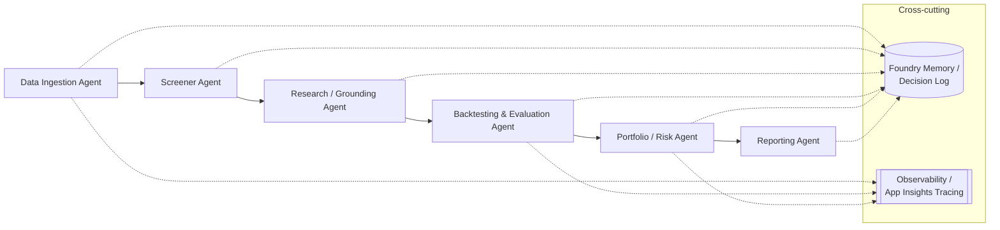

# Project Artha — Detailed Project Plan

> *Artha* — wealth pursued through sound, disciplined means.
> **Primary deliverable: hands-on learning** of Microsoft Foundry Agent Service + GitHub Copilot agentic features.
> **Secondary deliverable: an honest research/decision-support tool** for NSE/BSE equity investing — *not* a return-prediction machine.

---

## 0. Problem statement & guiding philosophy

Build a multi-agent research/decision-support system for Indian equities that makes the operator a more disciplined, better-informed investor. The system's job is **better research, better risk control, and an honest track record** — explicitly **not** a promised CAGR or a stock-picking oracle.

**Weighting is deliberate:** when learning depth and product features conflict, *learning wins*. Every phase has a learning checkpoint that is a first-class deliverable, not a side effect.

### Honesty guardrails baked into the whole project
- **No live capital** without a separate, explicit go-ahead. Default mode = research / backtest / paper.
- **Overfitting is the default suspicion.** Out-of-sample + walk-forward validation is mandatory; smooth equity curves, narrow-window parameter tuning, and cost-free backtests are treated as *red flags, not results*.
- **Benchmark-relative success only.** Everything is measured against Nifty 50 (or the relevant index) and a naive buy-and-hold baseline — never against an absolute return target.
- **Legitimate data only.** Official broker APIs, licensed vendors, or public regulatory filings. No ToS-violating scraping.
- **Every agent decision + rationale is logged** via Foundry observability/memory for honest post-mortems.

### Confirmed decisions
- **Language/stack:** Python (Foundry Python SDK + pandas / vectorbt / backtrader).
- **Primary data source:** Zerodha **Kite Connect** for price/OHLCV/order data, behind a broker-agnostic adapter. Deep fundamentals + full-text filings fall back to a licensed vendor (e.g. GFDL) or official NSE/BSE disclosure feeds.

---

## 1. Research summary A — Microsoft Foundry Agent Service (as available today)

*Sourced from Microsoft Learn, Foundry devblogs, and Ignite 2025 coverage. Treat exact feature names/GA status as fast-moving — re-verify at build time.*

| Capability | What's available | How Artha uses it |
|---|---|---|
| **Multi-agent orchestration** | Foundry Agent Service (GA) supports connected/multi-agent workflows: LLM-driven dynamic orchestration **and** deterministic YAML/visual workflow orchestration (auditable, step-by-step). Interop with Semantic Kernel, AutoGen, LangGraph. | Use **deterministic workflow orchestration** for the core pipeline (ingest → screen → research → backtest → risk → report) so runs are auditable; reserve LLM-driven delegation for the research/grounding agent. |
| **Foundry IQ grounding** | Enterprise retrieval/RAG layer with multi-source grounding (Bing, documents/SharePoint/Fabric), citations, document-level security. | Research/grounding agent summarizes news + filings **with citations** and explicit confidence flags. |
| **MCP tool connections** | MCP tool catalog + ability to expose any REST API / function as an MCP tool; large Logic Apps connector library. | Wrap Kite Connect, the backtester, and NSE/BSE filing feeds as MCP tools the agents call. |
| **Memory** | Persistent, session-aware, cross-agent memory for stateful multi-turn/multi-session tasks. | Persist watchlist state, decision logs, and prior research so post-mortems are reconstructable. |
| **Evaluation & observability** | End-to-end tracing of agent/tool/workflow steps; native Application Insights integration; built-in agent evaluation tooling. | Trace every decision + rationale; run agent evals on the research and screener agents. |
| **Security/governance** | Entra ID, RBAC, content filtering, VNet isolation, central control plane, model router. | Keep API keys/secrets in Key Vault; least-privilege RBAC; never embed broker credentials in agent prompts. |

**Learning implication:** Artha is a near-ideal Foundry teaching vehicle because it naturally exercises *all six* pillars (orchestration, grounding, tools/MCP, memory, evaluation, governance).

---

## 2. Research summary B — GitHub Copilot agentic features (as available today)

**Primary tool: the GitHub Copilot app** (the agentic Copilot experience with Plan mode, sessions, custom agents, skills, and multi-file agentic edits), not just the VS Code inline assistant. The same agentic features surface across the app, VS Code, and Copilot CLI.

| Feature | What it is | How Artha uses it (learning target) |
|---|---|---|
| **Agent mode / sessions** | Autonomous multi-step, multi-file execution: plans, edits many files, runs tests/builds, self-corrects in a plan→execute→validate loop; each task runs as its own session. | Primary coding driver for scaffolding agents, tools, and the backtester; one session per phase workstream. |
| **Plan mode** | Copilot proposes a reviewable plan (like this one) before executing, and persists a `plan.md`. | Use for every non-trivial change; practice reviewing/approving/redirecting plans. |
| **Custom agents** | Markdown + YAML frontmatter (`.github/agents/`) defining a persona, allowed tools, behavior. | Author a `quant-reviewer` agent (overfitting police) and a `compliance-reviewer` agent (SEBI / data-ToS checks). |
| **Custom instructions** | Always-on repo rules in `.github/copilot-instructions.md` or scoped `*.instructions.md`. | Encode honesty guardrails (no live capital, cost-aware backtests, benchmark-relative language) so Copilot itself resists overconfidence. |
| **Skills** | Portable instruction+script folders (`.github/skills/`, `~/.copilot/skills/`) auto-loaded for repeatable workflows. | A `walk-forward-backtest` skill and a `filing-summary` skill for reusable multi-step routines. |

**Learning implication:** the project intentionally uses Copilot to *build the thing that enforces discipline*, and encodes that discipline into Copilot's own config.

### 2.1 Token optimization & "caveman" prompting (explicit practice)

Working the GitHub Copilot app effectively over a long project means **treating tokens/context as a scarce, paid resource** — a first-class skill to build, not an afterthought.

- **Caveman prompting:** grammatically sparse, keyword-dense instructions — drop articles/filler, use shorthand and imperatives (e.g. *"screener agent: add ROE-trend check, log rationale, no strategy logic"* instead of a polite paragraph). Reserve prose for genuinely ambiguous design decisions.
- **Context hygiene:** short inspect→act→verify loops; scope reads with `view_range`/grep instead of dumping whole files; one session per workstream so unrelated context doesn't accumulate; start a fresh session when a thread is done rather than letting one balloon.
- **Push detail into config, not chat:** durable rules live in `copilot-instructions.md`, skills, and custom agents — so they're applied without being re-typed (and re-tokenized) every turn.
- **Delegate verbose work:** use sub-agents/background tasks for noisy builds/tests so only the summary returns to the main context.
- **Measure it:** track token/turn cost per phase as a discipline metric, the same way the tool tracks trading discipline.

**Learning checkpoint (cross-cutting):** be able to show a measurable drop in tokens-per-completed-task across phases from applying caveman prompting + context hygiene, with no loss of output quality.

---

## 3. Research summary C — Legitimate Indian data sources

| Source | Data | Licensing / fit |
|---|---|---|
| **Kite Connect (Zerodha)** — *chosen primary* | Real-time + historical OHLCV, F&O, portfolio, orders. Paid (~₹500/mo data). | SEBI-registered broker; compliant for the account holder. Thin on full fundamentals/filings. |
| **Upstox API** | Similar price/order data, option chains, some corporate actions. | Compliant broker API; kept as adapter fallback. |
| **GFDL (Global Financial Datafeeds)** | Historical OHLCV/tick, corporate actions, shareholding, financial results, board meetings, annual reports. | **Officially licensed exchange redistributor** — the clean path for deep fundamentals + filings. |
| **Refinitiv / Bloomberg / FactSet** | Full institutional suite. | Fully licensed but enterprise-cost; out of scope for a personal project. |
| **Official NSE/BSE corporate-filings feeds** | Results, disclosures, announcements, block/bulk deals. | Public regulatory disclosures — legitimate to consume directly per their terms. |
| **Community/unofficial scrapers (e.g. `nse-*` npm/py packages)** | Convenient but scraped. | **Excluded** — ToS/licensing risk; not used in Artha. |

**Data policy for Artha:** Kite Connect for prices/execution; NSE/BSE official disclosure feeds for filings; add a licensed vendor (GFDL) when fundamentals depth is the bottleneck. All behind a `DataSource` adapter interface so sources are swappable and their licensing constraints are documented in code.

---

## 4. Research summary D — SEBI algo-trading compliance (Feb 2025 framework)

*Framework announced Feb 2025; phased rollout with broad compliance expected through ~2026. Re-verify current thresholds/dates before any live phase — these evolve.*

- **Retail self-built ("DIY") algos** must be registered/approved via the broker at the exchange **once they cross the order-frequency threshold**; below it, the process is streamlined.
- **Order-frequency threshold:** commonly cited around **≥10 orders/second** triggers registration + higher compliance. (Verify exact current number.)
- **Broker API structure:** unique client-specific API key; **static/whitelisted IP**; strong auth (2FA / OAuth-style) — no broad username/password API logins.
- **Exchange tagging:** every algo strategy gets a **unique algo ID**; all algo orders must carry it for audit/traceability.
- **Family-only use:** a registered retail self-built algo may be used only by the developer + immediate family; no resale/sharing.
- **Broker is principal/accountable** for all API + algo activity; audit trails required.

**Compliance implication for Artha:** the design is *naturally* compliant because it is low-frequency (research/rebalance cadence, far below 10 OPS) and single-user. Any live phase (Phase 4) must still: use only official Kite Connect, register/tag if required, whitelist a static IP, and keep the operator + family as the only users.

---

## 5. Target architecture (research-refined)

Deterministic Foundry **workflow orchestration** across six agents, each backed by MCP tools, shared memory, and full tracing:

- **Data ingestion agent** — pulls OHLCV (Kite), filings/announcements (NSE/BSE feeds), fundamentals (vendor), normalizes via `DataSource` adapter.
- **Screener agent** — governance/red-flag checks (promoter pledging, ROE trend, dividend-vs-profit consistency, disclosure gaps, related-party transactions) + fundamental filters. **No strategy/timing logic.**
- **Research/grounding agent** — Foundry IQ (Bing + document grounding) summaries with **citations + explicit confidence/uncertainty flags**; forbidden from confident guessing.
- **Backtesting & evaluation agent** — walk-forward + out-of-sample tests; Sharpe, max drawdown, benchmark-relative alpha; **actively tries to falsify** a strategy before trusting it.
- **Portfolio/risk agent** — position sizing, exposure limits, drawdown circuit breakers.
- **Reporting agent** — plain-language periodic report: what it found, what it did, performance vs benchmark, and what it got wrong.

**Design guardrail flagged in-plan:** the six-agent split is a *learning-optimal* topology, not a performance-optimal one. If it ever adds latency/complexity without insight, collapse agents — don't preserve the diagram for its own sake.

---

## 6. Phased milestone plan

Each phase lists: goals · learning checkpoint · success criteria (benchmark-relative / risk-adjusted) · failure criteria · exit gate.

### Phase 0 — Environment, learning exercises, scaffolding
- **Goals:** Provision Foundry project + Application Insights; set up the GitHub Copilot app (agent mode/sessions, Plan mode, custom instructions, one custom agent, one skill); Python repo scaffold; secrets in Key Vault; `DataSource` adapter interface stubbed; Kite Connect sandbox auth working; encode honesty guardrails + a caveman/token-discipline note into `copilot-instructions.md`.
- **Learning checkpoint:** Can create a Foundry agent, connect one MCP tool, see a trace in App Insights, drive a multi-file change via Copilot Plan mode + agent mode, and articulate the caveman-prompting/context-hygiene baseline (starting tokens-per-task).
- **Success:** "Hello-agent" runs end-to-end with a traced tool call; a `quant-reviewer` custom agent exists; guardrail instructions committed.
- **Failure:** Can't get tracing/memory working → resolve before any data work.
- **Exit gate:** Repo scaffold + one working traced agent + Copilot customization committed.

### Phase 1 — Data ingestion + governance screener (no strategy logic)
- **Goals:** Implement ingestion agent (Kite OHLCV + NSE/BSE filings), normalize, persist. Implement screener agent with the governance red-flag checks + basic fundamental filters. Log every screen decision + rationale to memory.
- **Learning checkpoint:** Multi-agent handoff (ingest → screen) under deterministic Foundry workflow orchestration; MCP tool wrapping of a real API; memory-backed decision log.
- **Success:** For a defined watchlist, the screener reproduces known governance red flags on 2–3 hand-verified case studies (e.g., a historically pledged-promoter company) and produces cited, logged rationales. *No return claims at this stage.*
- **Failure:** Screener flags are inconsistent / not reproducible, or data licensing is unclear → stop and fix sourcing/logic.
- **Exit gate:** Reproducible, logged, benchmark-agnostic screening on ≥20 names with documented data provenance.

### Phase 2 — Backtesting framework with strict overfitting controls
- **Goals:** Backtesting & evaluation agent with **walk-forward + out-of-sample** as the default (in-sample-only runs disallowed). Model transaction costs, slippage, STT/taxes. Compute Sharpe, max drawdown, benchmark-relative alpha vs Nifty 50 + buy-and-hold. Build an explicit **falsification/overfitting report** (parameter sensitivity, deflated Sharpe, regime splits).
- **Learning checkpoint:** Foundry evaluation/observability on a non-LLM analytical agent; Copilot skill (`walk-forward-backtest`) authored and reused.
- **Success:** At least one candidate screen/strategy shows **out-of-sample, cost-inclusive, benchmark-relative** performance that survives walk-forward and parameter-sensitivity stress — *or* is honestly rejected. A clean rejection is a **success**, not a failure.
- **Failure:** The only "wins" are in-sample, cost-free, or vanish out-of-sample → strategy rejected; no promotion.
- **Exit gate:** A trustworthy, cost-aware, walk-forward backtest harness + at least one honestly-adjudicated strategy verdict.

### Phase 3 — Paper trading (live data, no real capital)
- **Goals:** Run the full six-agent pipeline against **live market data in paper mode** for a duration long enough to be statistically meaningful (target: multiple market regimes / months, pre-registered before starting — no stopping early because results look good). Portfolio/risk agent enforces exposure limits + drawdown circuit breakers on paper. Reporting agent issues periodic plain-language reports.
- **Learning checkpoint:** Long-running stateful memory + observability across many sessions; risk-agent circuit-breaker logic; report generation grounded in the decision log.
- **Success:** Over the pre-registered window, paper performance is **risk-adjusted competitive vs Nifty 50 and buy-and-hold** (e.g., non-negative benchmark-relative alpha at acceptable drawdown), *and* the decision log supports honest post-mortems. Discipline metrics (adherence to risk limits, no look-ahead) matter as much as returns.
- **Failure:** Underperforms benchmark on a risk-adjusted basis, breaches risk limits, or the log can't explain decisions → do not proceed to live; iterate or stop.
- **Exit gate:** A pre-registered paper track record + honest post-mortem. **This is the hard gate before any real money.**

### Phase 4 — Tightly capped, SEBI-compliant live pilot *(only if Phases 1–3 hold up honestly, and only with explicit separate go-ahead)*
- **Goals:** *Requires a separate explicit approval — not implied by this plan.* Small, hard-capped capital via official Kite Connect only. Verify + implement current SEBI algo requirements (registration/tagging if thresholds apply, static IP whitelist, strong auth). Hard risk limits + kill switch. Low-frequency by design (well under the OPS threshold). Family-only use.
- **Learning checkpoint:** Operating a governed, audited agent system against real consequences; secrets/RBAC/compliance in practice.
- **Success:** Live behavior matches paper expectations within tolerance; full compliance; risk limits never breached; every order traceable to a logged rationale.
- **Failure:** Any compliance gap, any unexplained order, or live/paper divergence beyond tolerance → halt immediately.
- **Exit gate:** N/A — this is the terminal, optional phase, gated on explicit human authorization.

---

## 7. Overconfidence / risk flags (raised in-plan, per your request)

1. **The six-agent architecture can masquerade as edge.** Sophistication ≠ predictive power. The plan measures *research quality and risk discipline*, not "smarter picks." Watch for confusing pipeline complexity with alpha.
2. **Paper→live divergence is the norm.** No slippage/liquidity surprises in paper. Phase 4 success criteria explicitly check paper-vs-live divergence.
3. **Regulatory drift.** SEBI thresholds/dates in §4 are point-in-time; the plan mandates re-verification before Phase 4, not reuse of these numbers.
4. **Survivorship & look-ahead bias** in Indian historical data are easy to introduce accidentally — the backtester must use point-in-time data and delisted names.
5. **"Statistically meaningful" paper window must be pre-registered.** Otherwise Phase 3 becomes a search for a flattering stopping point.
6. **LLM confidence ≠ correctness.** The research agent must surface uncertainty; a confident-sounding summary with no citation is a failure mode, not an output.

---

## 8. Cross-cutting deliverables (every phase)
- Decision + rationale logging to Foundry memory; App Insights tracing on.
- `copilot-instructions.md` guardrails kept current; `quant-reviewer` + `compliance-reviewer` custom agents run on relevant PRs.
- Data provenance + licensing documented in code next to each `DataSource`.
- **Token discipline:** apply caveman prompting + context hygiene (§2.1); record tokens-per-completed-task per phase and aim to reduce it without quality loss.
- A short written learning note per phase (what Foundry/Copilot concept was actually learned, *including* a token-optimization takeaway).
