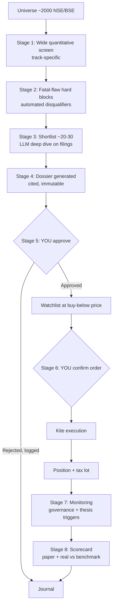

# Project Artha — Plan

> *Artha* — wealth pursued through sound, disciplined means.

**What this is:** an application that researches Indian equities, documents every investment decision to a reviewable standard, and places approved orders on Zerodha Kite — with investing discipline encoded as enforced guardrails rather than remembered intentions. This document is the authoritative specification: everything below is a live requirement.

**The design stance:** the application is the deliverable, not a notebook that supports a manual practice. The discipline lives as code — hard blocks, mandatory dossier sections, an append-only journal, and an allocation gate that demotes automatically — rather than as remembered good intentions.

**Judgement is made checkable, not left fuzzy.** "Quality," "growth" and "asymmetric" are not evaluated loosely; they are evaluated against **thirteen named super-investor frameworks**, embedded as explicit formulas, hard blocks and dossier sections, each sourced and attributed individually (§17 is the full traceability table): Raamdeo Agrawal's QGLP, Vijay Kedia's SMILE, Shelby Davis's Double Play, Peter Lynch's PEG/category taxonomy, Nick Sleep's & early Buffett's Scale Economies Shared, Mohnish Pabrai's Dhandho asymmetry + cloning, mature Buffett & Munger's moat/circle-of-competence, Benjamin Graham's margin of safety, Philip Fisher's scuttlebutt method, Joel Greenblatt's Magic Formula, Rakesh Jhunjhunwala's conviction sizing, Terry Smith's quality-compounding discipline, and William O'Neil's CANSLIM. Both tracks' targets are stated in explicit CAGR terms (§4), not only as a multiple over a timeframe.

---

## 1. The four goals, stated precisely

| # | Your goal | How this plan delivers it | Honest caveat |
|---|---|---|---|
| 1 | Research and suggest stocks that **2x–3x in 2–3 years**, or beat the index over 5+ years | Two-track research engine (§4): Track A compounders (15–22% CAGR) and Track B asymmetric bets (26–41% CAGR) that explicitly hunts doubles/triples, screened and diligenced using thirteen named super-investor frameworks (§17) | No process makes *each* pick 2x. The engine hunts asymmetry; the portfolio is judged vs the index (§2.5, §9) |
| 2 | **Place the order on Kite** once approved | Full execution path with a two-stage human approval gate (§7) | Legal and buildable — SEBI permits it (§12). No broker sandbox exists, so live-order testing needs care |
| 3 | **Document the entire research** for review before buying | The dossier is the product (§6). Every number carries a source citation; nothing reaches you undocumented | An LLM dossier is *evidence assembled*, not judgement. It can miss the omission that matters |
| 4 | Plan → **architecture** → implementation plan → build | This plan defines what and why, and fixes the decisions architecture depends on (§16) | — |

---

## 2. The honest numbers

The software changes *throughput and discipline*. It does not change the base rates.

### 2.1 What the app plausibly improves

- **Coverage** — screen ~2,000 listed companies instead of the ~20 you can read by hand.
- **Consistency** — the fatal-flaw checklist can never be skipped because it is a hard code block.
- **Detection speed** — governance red flags surface in days, not at the next annual report (§8).
- **Record honesty** — an append-only journal that cannot be quietly revised after the fact.

### 2.2 What it does not improve

Judgement about whether a business will still be winning in five years. SPIVA India: **84–94% of active large-cap funds trail their benchmark over 5 years**. Barber–Odean: **~10% of individuals beat the market long-run**. Those funds are full-time teams. A good pipeline moves you up that distribution; it does not exempt you from it.

**P(the sleeve beats its benchmark over 5 years): ~20–30%** — coverage and discipline are genuinely worth something, but only a few points of it. Anyone quoting higher is selling.

### 2.3 Tax drag, and why 12 months is a hard line

Post-July-2024 rates: **STCG 20%** (held <12 months), **LTCG 12.5%** (held >12 months, ₹1.25L annual exemption).

| A position doubles… | Gross | Tax | Net gain |
|---|---|---|---|
| …and is sold at month 11 | +100% | 20% | **+80%** |
| …and is sold at month 13 | +100% | 12.5% | **+87.5%** |

Two months of patience is worth **7.5 percentage points** on a double. **Encoded rule: nothing is sold before 12 months unless the thesis is broken.** This is why Track B's target window is framed as 2–3 years (§4), not less, and the engine should bias to the back half of that window.

### 2.4 The one that matters most: capping winners kills the strategy

The asymmetric track only works if winners are allowed to run past 2x. Two distributions of 10 bets over 2 years:

| Outcome shape | Result | 2-yr total | CAGR |
|---|---|---|---|
| **Winners capped at 2x** — 2 double, 3 up 25%, 3 down 10%, 2 down 40% | 165/10 | **+16.5%** | ~8% — *loses to the index* |
| **Winners allowed to run** — 1 up 4x, 2 double, 3 up 30%, 2 flat, 2 down 50% | 490/10 | **+49%** | ~22% — *beats it clearly* |

Same hit rate. The difference is entirely the sell rule. **So "2x" is a screening hypothesis, never a sell trigger.** This single insight drives §6's dossier spec and §7's sell rules — a naive implementation that books profit at 2x would systematically underperform.

### 2.5 The reframe on "2x–3x in 2–3 years"

Individual Indian small/midcaps double (or triple) in 2–3 years routinely — this is real, not fiction. What is fiction is a *portfolio* reliably compounding at that rate. So:

- **The engine's job:** find setups where 2x–3x is *plausible* and the downside is *capped* — asymmetry, not certainty, sharpened by the thirteen named screens and hard blocks in §5 and §17.
- **The scorecard's job:** judge the sleeve against the frozen benchmark post-tax over multi-year windows (§9).
- Individual doubles are the *mechanism*. Beating the index is the *measure*. §4 states both mechanism and measure as explicit CAGR bands (15–22% Track A, 26–41% Track B), so the claim is checkable rather than rhetorical.

---

## 3. Product definition

A local-first Python application, run on your machine, that executes this pipeline:

**Design principles**
1. **Nothing reaches you undocumented.** No suggestion without a dossier.
2. **Two human gates.** Thesis approval, then order confirmation. Neither is skippable.
3. **Hard blocks are hard.** A disqualifier ends the analysis; there is no override flag.
4. **Append-only journal.** Including *deliberate inaction* — the decisions not to buy are the record's most honest part.
5. **Dry-run by default.** Live execution requires explicit, deliberate enabling.

---

## 4. The two tracks

Each track gets its own screens, dossier template, sizing rules, and **its own scorecard** — so you learn which one actually works rather than blending them into one unattributable number. Both tracks' targets are stated in explicit CAGR terms, reconciling the "beat the index" framing with the "2x in a few years" framing that motivates this plan (§1):

| | **Track A — Compounders** | **Track B — Asymmetric bets** |
|---|---|---|
| **Thesis shape** | Durable quality bought at a fair price | Earnings inflection, turnaround, cyclical upturn, re-rating, deleveraging |
| **Screen emphasis** | ROCE consistency, FCF/PAT reconciliation, low debt, earnings stability across a cycle; Agrawal QGLP, Graham defensive criteria, Terry Smith quality-compounding metrics, Buffett/Munger moat proxies (§17) | **Reported** inflection — earnings acceleration (QoQ/YoY), margin expansion, capex-cycle turn, debt reduction, depressed base, low institutional coverage. *Deliberately not estimate revisions* (§13.3b). Davis Double Play, Kedia SMILE, O'Neil CANSLIM overlay (§17) |
| **Holding period** | 5+ years | 2–3 years (never shorter — a 2x in under 2 years is a rarer outcome than the framework should be built to expect) |
| **Target CAGR** | **15–22%**, low maintenance | **26–41%** — i.e. a 2x–3x total return over the 2–3 year holding period |
| **Target (mechanism)** | Beat index over a decade | 2x–3x, winners allowed to run past it |
| **Sizing** | 2–3% of investable assets | **1–1.5%** — tighter, higher variance |
| **Sleeve share** | ~60% of active sleeve | **~40% cap** |
| **Failure mode to guard** | Overpaying for quality; value-trap "compounders" | Value traps, accounting fraud, one-off earnings mistaken for inflection |
| **Sell rule** | Thesis broken; price far exceeds defensible value | Thesis broken; **never a mechanical 2x trim** (§2.4) |

**On the CAGR bands:** these are honest restatements of the mechanism described in §2.5, not new promises. A 2x in 2 years is a 41% CAGR; a 3x in 3 years is a 44% CAGR; the 26% floor is a 2x stretched to 3 years. Track A's 15–22% band is the "beat the index, plausibly by several points" claim of §2.2 expressed as a number instead of a comparison. **Neither band is a forecast for any individual pick — see §9 for how the sleeve is actually judged.**

**Cross-cutting hard limits** (apply to the whole sleeve): max ~25% in one name, ~30% in one sector, ~35% in small caps. No leverage, no F&O, no margin, no derivatives — ever.

---

## 5. The research pipeline

### 5.1 Universe & liquidity floor
NSE/BSE listed, with a minimum market cap and traded-volume floor so positions are exitable. Microcaps below the floor are excluded — not deprioritised, excluded.

### 5.2 Universe policy — no sector exclusions, competence enforced late
**There is no sector allowlist.** Every company clearing §5.1 enters Stage 1, including banks, NBFCs, insurers, pharma, manufacturing, utilities and commodities. An allowlist would have discarded a large share of India's best long-run compounders and nearly all of its cyclical turnarounds *before a single number was looked at* — and it would have done so on a category judgement ("banks are leveraged black boxes") rather than on evidence about any particular company.

Competence still matters; it is enforced **twice, and later**, where it costs almost nothing to be wrong:
- **Stage 1 — sector-adapted rule sets (§5.3a).** A name is dropped only for failing *its own sector's arithmetic*, never for its sector label. Applying D/E ≤ 1.0 or OCF/PAT to a bank is not prudence, it is a category error.
- **Stage 3 — per-company understandability gate (§5.5, §6.15).** Can *this* business be explained, its unit economics traced, its accounting read? A fail reads "not underwritable on the available evidence," naming the failed gate — never "wrong sector."

**What replaces the allowlist as a spend control:** the §5.1 liquidity floor, plus Stage 1's ranking and Stage 2's hard blocks. Research spend is rationed by rank, not by sector membership — the funnel already narrows ~2,000 names to ~20–30 before the expensive stage begins.

**The honest cost of a wider universe — sector competence files.** Harder sectors get *more* work, not a ban. Before any candidate from a sector reaches Stage 3, a short versioned markdown **sector competence file** must exist in the repo: what actually drives the economics, which standard ratios are meaningless there and why, the 3–5 sector-specific fatal flaws, and the sector-native comparison set. Missing file → the candidate is **deferred and the file is written**, not rejected. This converts "outside my circle" from a permanent exclusion into a backlog item, which is what it always should have been.

**Concentration is handled by §4's ~30% sector cap**, not by exclusion — that is the correct instrument for "don't bet the sleeve on one sector," and it does not cost us the individual opportunity.

### 5.3 Stage 1 — wide quantitative screen
Cheap, runs over the full universe, track-specific rule sets. Output: a few hundred names, ranked. The rule sets are explicit, attributed formulas (full citations, thresholds and caveats in §17).

**Screener does the fetching; Artha does the judging.** The universe is exported from Screener Premium (§13.2a) filtered only by §5.1's market-cap and liquidity floor — *not* by the rules below. Encoding §5.3/§5.4 as Screener query filters would put this plan's intellectual content in a vendor's query box instead of version-controlled, testable code, and it would break §5.4's Greenblatt gate, which must rank an **unfiltered** universe to have a decile at all.

Because the export is **one row per company**, Stage 1 splits in two:

| | Tests | Data | Volume |
|---|---|---|---|
| **Stage 1a** | **Level** tests — current thresholds and ratios, plus the Greenblatt ordinal rank (§5.4) | CSV snapshot, ~50 columns | ~2,000 |
| **Stage 1b** | **History** tests — multi-year consistency and own-history comparisons, which no single row can answer | Per-company pages and BSE filings | ~200–300 |

Stage 1b carries, among others: ROE/ROIC sustained ≥15 of the last 10 years; "no year of EPS decline"; Graham's 10-year earnings-deficit and dividend-record tests; P/E on 3-yr average EPS; and Davis's own-5-year-history P/E tercile. Deferring these to ~200–300 names rather than running them across 2,000 is what keeps the data layer cheap (§13).

**One export per arithmetic profile, not one export for everything.** The 50-column ceiling (§13.4a) cannot carry the standard field set *and* GNPA/CAR/NIM/CASA *and* embedded-value fields in a single CSV. It doesn't have to: Screener Premium exports *any* custom screen at no extra cost, so Stage 1a runs one export per profile (§5.3a) — same snapshot date, same hashing and provenance rules (§16.6), concatenated into one ranked universe. This costs an extra few minutes of manual export per run (§13.6) and nothing else.

The rule sets (Profile 1 — standard; see §5.3a for Profiles 2–5):

**Track A (compounders):**
- **Quality gate (Agrawal QGLP "Q"):** ROE ≥ 15% and ROCE ≥ 15% (3-yr avg; ≥20% ideal), D/E ≤ 1.0, OCF/PAT ≥ 0.8, promoter holding ≥ 50% and not declining.
- **Moat/quality refinement (Buffett & Munger; Terry Smith):** ROE/ROIC sustained ≥ 15 of the last 10 years above WACC; for the highest-conviction subset, gross margin ≥ 50%, ROCE ≥ 20%, interest cover ≥ 10×, FCF conversion (FCF/Net Income) ≥ 80%.
- **Growth gate (Agrawal QGLP "G"):** PAT CAGR ≥ 15% over 5 years (≥20% ideal); no year of EPS decline.
- **Graham defensive criteria (optional qualifying screen, thresholds relaxed for the Indian listing base per §17's caveat):** current ratio ≥ 2.0; no earnings deficit in the last 10 years; P/E ≤ 15× (3-yr avg EPS); P/B ≤ 1.5×; P/E × P/B ≤ 22.5 (the "Graham Number" ceiling); dividend record relaxed to ≥ 10 consecutive years (Graham's original 20-year test excludes almost every Indian listing).

**Track B (asymmetric bets):**
- **Davis Double Play screen:** entry P/E in the bottom tercile of the stock's own 5-year history **and** ≤ 80% of sector-median P/E; trailing EPS growth ≥ 15% together with ***reported* acceleration** (latest-quarter EPS YoY, and TTM vs prior TTM, both positive and improving); ROE ≥ 15%; D/E ≤ 1.5×; P/E floor ≥ 5× (excludes distress/value-traps). **This clause deliberately tests reported inflection, never forward estimates** — consensus does not exist affordably for India (§13.3b), the smallcaps Kedia SMILE hunts are by definition analyst-uncovered, and the implied-return formula below already consumes *trailing* EPS CAGR, so a forward number was never used by the screen it gated. Implied-return score: `(1 + trailing EPS CAGR)^3 × (sector-median P/E ÷ entry P/E) − 1` — the multiplicative "double play," never additive.
- **Lynch PEG screen:** `PEG = P/E ÷ trailing 5-yr EPS growth %` (dividend-yield-adjusted — `P/E ÷ (growth % + dividend yield %)` — for stalwarts/slow growers). Buy zone PEG < 1.0 (primary band 0.5–1.0); classify every candidate into Lynch's taxonomy (fast grower ≥20% EPS CAGR, stalwart 8–12%, slow grower ≤6%, cyclical, turnaround, asset play) so the dossier's growth claims are checked against the right comparison set.
- **Kedia SMILE screen:** market cap ₹200 Cr (Artha's own liquidity floor, §5.1) – ₹5,000 Cr (Kedia's stated ceiling); years since incorporation 10–35 (proxy for "medium" management experience); promoter holding ≥ 40%; low sell-side analyst coverage. The "Large aspiration" and "Extra-large market opportunity" letters are qualitative and deferred to Stage 3 — no numeric proxy is reliable enough for a hard Stage 1 filter.
- **O'Neil CANSLIM momentum overlay (Track B only, applied *after* the fundamental filters above pass — a timing layer, not a substitute for them):** current-quarter EPS growth ≥ 25% YoY (accelerating preferred); 3-year EPS CAGR ≥ 25% with ROE ≥ 17%; price within 5% of a breakout pivot from a proper chart base (cup-with-handle or flat base); breakout-day volume ≥ 40% above the 50-day average; constructed NSE/BSE relative-strength percentile ≥ 80; rising institutional ownership; Nifty 50/Sensex in a confirmed uptrend. This answers "is it ready to buy *now*," not "is it a good business" — that's still the fundamental screen's job.

### 5.3a Sector-adapted rule sets (the mechanism behind §5.2)
The rule sets above are written for a conventional non-financial P&L. Run unchanged over a bank, they reject it for being a bank. So every company is assigned exactly one **arithmetic profile**, machine-derived from its reported statement format and industry code (not from a hand-maintained list), logged on the dossier (§6.1), and screened against that profile's rules:

| Profile | Applies to | What changes |
|---|---|---|
| **1 — Standard** | All non-financial operating companies (the large majority) | Nothing. §5.3 as written. |
| **2 — Lending** | Banks, NBFCs, housing finance | Leverage *is* the business, so **D/E, ROCE, OCF/PAT, EBIT and all EV-based metrics are dropped as meaningless**, not failed. Substitutes: ROA ≥ 1.5% (banks) / ≥ 2.5% (NBFCs); ROE ≥ 15%; NIM stable or expanding over 3 years; GNPA ≤ 3%, NNPA ≤ 1%; provision coverage ≥ 70%; credit cost ≤ 1.5% and not rising two years running; CAR ≥ 15% with Tier-1 ≥ 12%; advances CAGR ≥ 15% over 5 years *without* deterioration in the deposit/borrowing mix; CASA ratio (banks) and ALM gap plus borrowing concentration (NBFCs). Valuation on **P/B read against ROE**, not P/E alone. |
| **3 — Insurance** | Life and general insurers | VNB margin, embedded-value growth, 13th/61st-month persistency (life); combined ratio ≤ 100% (general); solvency ratio ≥ 1.8×. Valuation on **P/EV**. |
| **4 — Regulated/utility** | Power, transmission, regulated infrastructure | Returns are capped by regulation, so test **realised RoE against the allowed band** rather than against 15%; PLF/availability; receivable days from state discoms (the actual killer here); D/E ceiling relaxed to 2.5× where cash flows are contracted; ROCE on gross block. |
| **5 — Deep cyclical** | Metals, chemicals, commodities, shipping, sugar | Every gate runs on **mid-cycle (7–10 year average) earnings and margins, never trailing peak**; net-debt/EBITDA ≤ 3× at mid-cycle; cost-curve position and capacity-cycle stage recorded. A name that is cheap only on peak trailing earnings is **flagged as peak-cycle, not passed** — this is the single most common way a cyclical looks like a Track B bargain and isn't. |

**Pharma is deliberately *not* a separate profile** — its statements are conventional and Profile 1 applies. What the old allowlist called "regulatory binaries" becomes four **mandatory Stage 2 checks** instead of a reason to never look: USFDA/regulatory action in the last 5 years (OAI, warning letter, import alert); revenue concentration above 30% in a single molecule or single facility; US price-erosion exposure; and R&D capitalisation policy. Tested, not assumed fatal.

**Attribution honesty (per §17's caveat):** none of these thresholds come from the investors in §17 — every one of those frameworks was built on non-financial businesses, and several authors (Greenblatt explicitly) excluded financials rather than adapt. Profiles 2–5 are **Artha's own operationalisation**, and are labelled as such wherever they appear. They are the price of a wider universe, and they must be backtested separately (§9) rather than inheriting the credibility of the frameworks they sit beside.

### 5.4 Stage 2 — fatal-flaw hard blocks

~15 disqualifying questions, automated where the data allows. **Any "no" or "unknown" ends the analysis.** No score, no override:
- Does profit become cash, or does FCF chronically diverge from PAT?
- Promoter pledging, related-party transactions, auditor resignations?
- Can it survive its worst historical year without dilution?
- Single customer / regulator / input that can end it?
- Serial equity dilution?
- Can the business be explained in five sentences?
- What is the price already assuming, and is that plausible?

Questions the data cannot answer become **mandatory LLM-verified items** in Stage 3, flagged if unresolvable. **Promoter pledging starts here** — no affordable API exposes it as a structured field (§13.3a), so it is LLM-verified from shareholding-pattern filings and **fails closed** when it cannot be established.

**The questions' intent is universal; their arithmetic is not.** For Profile 2–5 names (§5.3a) each question is answered in its sector's own terms — "does profit become cash?" becomes "are earnings being manufactured by under-provisioning or by recognising unrealised gains?" for a lender, and "is this trailing profit a mid-cycle number or a peak one?" for a deep cyclical. The substitutions are specified in the sector competence file (§5.2) and recorded per-question in the dossier. **A question may be restated, never dropped.**

**Two further hard blocks, both attributed in §17:**
- **Greenblatt Magic Formula ranking gate:** rank the post-Stage-1 universe by `ROC = EBIT ÷ (Net Working Capital [ex-excess-cash, ex-short-term-debt] + Net Fixed Assets [ex-goodwill])` and by `Earnings Yield = EBIT ÷ Enterprise Value`, sum the two ordinal ranks, and require a candidate to sit in the best combined-rank decile of its (financials/utilities-excluded) universe. This is Greenblatt's exact ranking methodology, not a generic "ROCE > X% and Earnings Yield > Y%" threshold — the distinction matters because ordinal ranking is stable across market cycles while absolute thresholds are not (§17). **Greenblatt excludes financials and utilities because both his formulas are undefined for them — so for Profile 2–5 names (§5.3a) the gate is *substituted, not waived*:** rank within the sector-native peer set by return (ROA for lending, RoE-vs-allowed-band for regulated, mid-cycle ROCE for cyclicals) and by `Earnings Yield = PAT ÷ Market Cap`, sum the ordinal ranks, best decile of that peer set. Same discipline, defined arithmetic — and flagged in the dossier (§6.21) as Artha's extension, not Greenblatt's method.
- **Pabrai asymmetry gate (Track B, and any Track A name flagged as statistically distressed-cheap):** a Downside-Floor Score (net-cash/tangible-asset backing, bear-case FCF survival, debt safety, liquidation-value coverage — 8 tests, /16) must score ≥ 10/16, **and** the Asymmetry Ratio (`bull-case upside % ÷ bear-case downside %`) must be ≥ 3:1. Fails either test → hard disqualify, no override.

**Expanded promoter-integrity red flags** (feeding the pledging/RPT check above): promoter holding declining over 3 years; pledge > 20% of promoter holding (Agrawal); any SEBI show-cause order, adverse related-party transaction, or auditor resignation within 5 years (Fisher Point 15 — "management of unquestionable integrity" — treated as a single bad-faith signal that no amount of other strength offsets).

### 5.5 Stage 3 — deep dive (the expensive stage)
On ~20–30 names: LLM reads annual reports, quarterly filings, concall transcripts and investor presentations. Extracts related-party transactions, auditor changes, contingent liabilities, segment trends; diffs this year's MD&A against last year's; red-teams the emerging thesis.

**Rules:** every extracted claim carries a **source citation (document + page)**. Uncited claims are defects and are dropped. The LLM must report **what it could not verify** — that list goes in the dossier. An LLM red-team is not independent evidence.

**Five qualitative extraction tasks run at this stage** (full prompts and sourcing in §17):
- **Understandability gate (Buffett & Munger's circle of competence, applied per company rather than per sector — §5.2):** apply the 7-gate checklist (five-sentence business-model test, unit-economics clarity, industry-structure stability, 5–10yr demand forecastability, management understandability, accounting transparency, an identifiable moat source) — all seven must pass before the LLM proceeds to full dossier construction. **The judgement is about this company on this evidence, never about its sector.** A fail is recorded as "not underwritable on the available evidence," naming the failed gate and the evidence that would resolve it — not silently downgraded. For Profile 2–5 names (§5.3a) the gate is applied **against that sector's competence file** (§5.2): stability and forecastability are judged relative to the sector's own norms, so a cyclical is not failed merely for being cyclical, nor a bank for having a balance sheet. If the competence file does not exist, the candidate is **deferred until it is written**, not rejected.
- **Scuttlebutt extraction (Fisher):** apply the 15-point checklist via digital proxies — employee-sentiment sites, concall Q&A candour/evasion scoring, analyst/competitor commentary, customer-review sentiment, channel/distributor checks, patent/R&D signals, governance red flags — since literal customer/competitor calls aren't feasible for an automated pipeline.
- **Pricing-power / Scale-Economies-Shared extraction (Sleep & Buffett):** read for explicit management language about passing scale-driven cost savings to customers versus extracting margin (8 extraction prompts in §17); compute 3yr/5yr **ROIIC** (`ΔNOPAT ÷ ΔInvested Capital`, one-period lag) as the quantitative companion — ROIIC ≥ 25–30% is the "genuine compounder" threshold.
- **Promoter aspiration & TAM assessment (Kedia "L" and "E"):** LLM reads capex plans, revenue-target language, and promoter concall/media tone for evidence of scaling ambition; sizes the addressable market so the candidate's current revenue is a small fraction of it ("the market should be so big the company always remains small").
- **Conviction scoring (Jhunjhunwala):** the LLM assembles a 1–5 conviction score from evidence quality (business clarity, management-quality checks, FCF/PAT reconciliation, thesis specificity, disconfirming-evidence adequacy) that modulates *where in the sizing band* (§4) a position falls — never a return forecast, and always subject to human override at Gate 1 (§7.1). The companion monitoring rule — **a falling price alone is not a sell signal; only thesis-breaking evidence is** — is already Artha's rule (§7.3); Jhunjhunwala's framework is cited here because it is the clearest public articulation of it.

### 5.6 Stage 4 — the dossier (§6)

### 5.7 Patience
Approved theses sit on a watchlist at their buy-below price, often for months. **Inactivity is the intended state.** The app must never nudge you to act.

---

## 6. The dossier — this is the product (goal 3)

One markdown file per candidate, immutable once approved, versioned in git. **Mandatory sections:**

1. **Identity** — company, ticker, sector, **arithmetic profile (§5.3a)**, track, date, pipeline run ID, data snapshot ID
2. **The business in five sentences** — if it can't be written, the analysis ends
3. **Why now** — the specific trigger or catalyst
4. **The three things that must be true**
5. **Financial evidence** — every figure with a source citation
6. **Fatal-flaw checklist** — each item, its evidence, pass/fail
7. **Valuation** — bear / base / bull with assumptions stated explicitly
8. **Buy-below price** and proposed position size with rationale
9. **Pre-mortem** — *it is two years on and this lost 60%: what happened?*
10. **Kill triggers** — machine-checkable wherever possible, wired into §8 monitoring
11. **What would make me add more**
12. **Disconfirming evidence** — mandatory; what argues *against* this. An empty section fails review
13. **Expected holding period** and the 12-month tax line (§2.3)
14. **Provenance** — model, prompt version, documents read, and **what could not be verified**

Sections 12 and 14 are the anti-self-deception mechanism. A dossier missing either is rejected by the tooling, not by your discipline.

**Framework sections — also mandatory** (§17 gives full sourcing). Sections 15 and 18 are *gates* — a fail there halts the dossier before the remaining sections are written, since there is no point pricing a business the LLM cannot explain or a promoter it cannot trust. The rest are evidence sections like 1–14.

15. **Moat & Understandability Memo** (Buffett & Munger) — *gate; both tracks.* Moat type identified with evidence (brand, switching cost, network effect, cost advantage, efficient scale/regulatory); 10-year ROE/ROIC-vs-WACC trend (or the Profile 2–5 substitute return series, §5.3a); the five-sentence business-model test result; the 7-gate understandability checklist outcome — **assessed per company against the sector competence file, never as a sector verdict (§5.2)** — and a short inversion-checklist summary ("what would make this fail," per Munger).
16. **QGLP Scorecard** (Raamdeo Agrawal) — *primarily Track A.* Quality / Growth / Longevity / Price scored 0–3 each (§5.3, §17) with evidence per letter and the combined score out of 12; Price is scored last, by design.
17. **Margin-of-Safety & Scuttlebutt Notes** (Graham + Fisher, combined into one qualitative-diligence block) — *both tracks.* Graham's seven defensive-investor criteria with pass/fail evidence, computed margin of safety vs. an intrinsic-value estimate, and the Graham Number ceiling; Fisher's 15-point checklist scored pass/partial/fail/unknown with source-cited evidence per point.
18. **Super-Investor Integrity Gate** (Fisher Point 15 + Agrawal governance signals) — *gate; both tracks.* This is the dossier-level record of the expanded promoter-integrity red flags in §5.4 — kept as its own gated section, not buried in the fatal-flaw checklist, because management integrity is a single-point-of-failure the other 23 sections cannot compensate for.
19. **The Davis Double Play Mechanism** (Shelby Davis) — *Track B.* Entry P/E, trailing EPS growth **and reported acceleration** (forward estimates are deliberately excluded — §5.3, §13.3b), the sector-median re-rating target, the implied multiplicative return (§5.3's formula) and CAGR, and the "double play in reverse" risk flag if earnings and multiple could fall together.
20. **Scale Economies Shared Assessment** (Nick Sleep & early Buffett) — *both tracks, most relevant where pricing power is the thesis.* ROIIC (3yr/5yr), volume-vs-price decomposition, quoted-and-cited management language on passing scale savings to customers, and a moat-widening/stable/narrowing verdict.
21. **Magic Formula Attribution** (Joel Greenblatt) — *both tracks.* The stock's ROC and Earnings Yield values, their ordinal ranks and percentile within the Stage-2 investable universe, and the combined rank — a quantitative-entry note, not a standalone buy case. For Profile 2–5 names this records the **substituted sector-native rank** (§5.4) and states plainly that it is Artha's extension, not Greenblatt's method.
22. **Quality-Compounding Checklist** (Terry Smith) — *Track A.* ROCE trend, FCF conversion %, gross margin vs. sector, interest cover, and the reinvestment-runway rationale for why the price is justified despite not being statistically cheap — plus a reminder that "do nothing" means not selling absent thesis impairment, not absolute inertia.
23. **Super-Investor Alignment / Cloning & Conviction Sizing** (Pabrai + Jhunjhunwala, combined) — *both tracks.* The Pabrai Downside-Floor Score (/16) and Asymmetry Ratio from the Stage-2 gate (§5.4); any cross-reference against known Indian super-investors' disclosed shareholding (bulk/block deals, >1% shareholding-pattern filings); and the Jhunjhunwala conviction score (1–5) with its rationale, mapped to the proposed position size within §4's sizing band.
24. **CANSLIM Momentum Screen Notes** (William O'Neil) — *Track B only, omitted for Track A.* Current/annual EPS growth, constructed RS-Rating percentile, breakout volume vs. average, market-direction assessment, and the momentum-breakdown definition that feeds §8 monitoring.

---

## 7. Approval and execution (goal 2)

### 7.1 Two gates
- **Gate 1 — thesis approval.** You read the dossier and record APPROVED / REJECTED / DEFERRED with a reason. All three outcomes are journalled.
- **Gate 2 — order confirmation.** When price hits buy-below, the app proposes an order showing quantity, price, total value, resulting position size, and sleeve impact. **You confirm explicitly.** Nothing is ever sent without this.

Between the two gates, the app's only autonomous act is *watching a price*.

### 7.2 Execution safety
Kite Connect has **no sandbox — every order is live.** Therefore:
- **Dry-run mode is the default**, and is a persisted setting, not a CLI flag.
- First live order is a **single share** to validate the whole path end-to-end.
- Hard cap on maximum order value; orders rejected outside market hours.
- Idempotency keys so a retry can never double-send.
- Every fill reconciled against Kite holdings; mismatch halts the app.
- Kill switch that disables execution without touching research.
- Credentials in the OS keyring. Never in the repo, never in env files committed to git.

### 7.3 Sell discipline
No stop-losses — a falling price on an intact thesis is an opportunity. Sell only when the **thesis breaks**, price **far exceeds** defensible value, or a **materially better opportunity** exists with capital fully deployed. **No mechanical trim at 2x** (§2.4). Never average down on a broken thesis; adding to a sound one at a lower price is the entire point. **Attribution:** this is Terry Smith's "do nothing" — discipline against needless activity, not inertia — and Jhunjhunwala's "a fluctuating price is not business performance" (§5.5, §17); a name in genuine thesis-breaking territory (§8's alert taxonomy) is reviewed promptly, not defended out of stubbornness.

---

## 8. Monitoring — the highest-value automation

Alerts within days, not at the next annual report: auditor resignation, promoter pledge changes, credit rating downgrades, large related-party transactions, sudden promoter selling, regulatory action, insider-trading disclosures.

Plus **thesis-specific triggers** from each dossier's §10 — the app watches for the conditions you yourself said would prove you wrong. This is the piece a fund cannot replicate for your ten names, and it goes live **before** real capital does.

**Four super-investor-derived auto-flags** (sourcing in §17):
- **Inventory build-up (Lynch):** inventory YoY growth exceeding revenue YoY growth for 2 consecutive quarters raises a WATCH flag; 3 consecutive quarters, or the inventory/revenue ratio hitting a 3-year high, raises an ALERT — unsold goods piling up precedes margin-compressing markdowns.
- **Margin compression:** gross or operating margin contracting for 2+ consecutive quarters without a stated one-off cause, cross-checked against the Scale-Economies-Shared verdict (§5.5) so a deliberate Sleep-style price-passthrough isn't misread as deterioration.
- **Promoter pledging (severity tiers, extending the §5.4 pledging check):** any new pledge is logged; a pledge increase, or pledge crossing 20% of promoter holding, raises an ALERT; pledge exceeding 50% of promoter holding is treated as thesis-breaking evidence (§5.4).
- **Momentum breakdown (O'Neil, Track B only):** price falling ≥ 7–8% below the original buy-point pivot is an automatic review trigger; price falling back below the breakout base, or the constructed RS-Rating dropping from ≥ 80 at entry to below 70, raises a review flag; a market-wide distribution-day cluster pauses new Track B entries.

**Alert taxonomy (Jhunjhunwala's "price versus thesis" discipline, formalising §7.3):** every alert is classified Category A — **thesis-neutral** (a price move or sector-wide sell-off with no accompanying fundamentals event: logged, not alerted); Category B — **thesis-review trigger** (e.g. two consecutive unexplained earnings misses, market-share loss, a key departure without succession clarity: surfaces the dossier's §4 thesis for human review); or Category C — **thesis-breaking evidence** (auditor resignation, promoter pledge above the 50% tier, a credit-rating downgrade below investment grade, or any dossier §10 kill trigger firing: drafts a sell-consideration note immediately). Only Category C is a sell signal — this is the encoded form of §7.3's rule.

---

## 9. Evidence gate and scorecard

**Benchmark, frozen before the first purchase and never changed:** a named Nifty 50 TR index fund plus one named factor fund (Momentum 30 or Quality 30), fixed weights, recorded by name. Time-weighted returns for skill, money-weighted for wealth, both post-tax including accrued liability on unrealised gains. Judged against each benchmark independently — beating one and losing the other is a loss.

**From day one the app paper-trades every recommendation**, with immutable timestamped dossiers. Because the engine generates evidence continuously, the gate is measured in months rather than years.

| Stage | Active allocation | Condition to advance |
|---|---|---|
| Paper | 0% | 20+ dossiers generated and reviewed; pipeline reproducible; scorecard engine tested |
| S1 | ~5% | IPS complete; benchmark frozen; monitoring live; execution validated on a 1-share order |
| S2 | ~10% | 12 months of paper + real record; every position fully documented; zero rule breaches |
| S3 | ~15% | 24+ months; ahead of the benchmark set post-tax; ≥15 aged decisions |
| S4 | ~20% | 4+ years; 30+ aged decisions; edge attributable to a named source and a named track |

**Demotion is automatic and symmetric.** Any purchase without an approved dossier, or any breach of §4's limits, steps the allocation down one stage. No discretionary override — it is enforced in code.

**Per-track scorecards.** Track A and Track B are scored separately. A track that trails its benchmark over its own evaluation window is shut down independently of the other.

**Per-profile attribution (added with §5.3a).** Results are also tagged by arithmetic profile, so that if the newly-admitted sectors underperform, that is visible as a Profile 2/4/5 failure rather than being averaged into the sleeve and blamed on the track. This is the accountability mechanism for widening the universe: **it does not stop us buying a bank, it stops us buying banks badly for four years without noticing.** A profile with 8+ aged decisions and no edge is retired on the same terms a track is.

---

## 10. Portfolio and risk

| Sleeve | Share | Notes |
|---|---|---|
| **Passive core** | ~65–70% | Nifty 50 index fund + one factor fund + a flexi-cap. Where most wealth is actually built. Out of the app's scope. |
| **Ballast** | ~15% | Gold, debt/liquid, some US equity. Realistically 8–9%, and that is fine — its job is to not fall with the rest. |
| **Active sleeve** | **~15–20%** (staged per §9) | 8–10 positions across both tracks. This is what the app manages. |

**Personal investment policy — the gate before everything.** Emergency fund of 6–12 months, untouchable. Term life and independent health cover. High-cost debt cleared. Obligations within 5 years funded in debt, never equity. And the correlation most people miss: **your income is Indian tech, and Indian equities fall when Indian tech hiring freezes** — the emergency fund is sized for that scenario specifically. *Investable assets* is what remains; only that is in scope.

**Expect the sleeve to draw down 40%+ at some point.** At 17.5% allocation that is ~7% of total wealth — precisely why it is sized this way. The pre-committed response is: do nothing, or buy.

---

## 11. Phases

Each phase earns the next, and each ends in something that demonstrably works.

**Phase 0 — Foundations.** IPS written. Benchmark frozen and recorded. Passive core and ballast funded. Repo skeleton, SQLite schema, config, secrets in keyring. *Exit: IPS exists; passive portfolio live; `artha --version` runs.*

**Phase 1 — Data spine.** **Starts with the §13.4 validation spike: confirm Screener Premium's 50-column export carries the full Stage 1/Stage 2 field set — including Greenblatt's ROC and EV components and the shareholding fields — and measure completeness on 50–100 known smallcaps before building on it.** Then ingest the exported universe snapshot, prices, and BSE feeds. Snapshot and cache with provenance, including §13.6's staleness guard. *Exit: spike results recorded; a screen run reproduces exactly from a stored, hashed CSV snapshot; every field traceable to a source.*

**Phase 2 — Screening + disqualifiers.** Both track screens (the full formula set — Agrawal QGLP, Graham, Terry Smith, Buffett/Munger moat proxies, Davis, Lynch PEG, Kedia SMILE, O'Neil overlay — and the Greenblatt/Pabrai hard blocks, §5.3–§5.4) and the automated fatal-flaw blocks. *Exit: a run produces a ranked shortlist per track, with every exclusion explained and attributed to the rule that fired.*

**Phase 3 — Deep research + dossiers.** Filing retrieval, LLM extraction with citations, dossier generation across all 24 mandatory sections (§6). *Exit: 20+ dossiers that pass their own completeness checks, including disconfirming-evidence, provenance, and the two gate sections (understandability, integrity).*

**Phase 4 — Paper ledger + scorecard.** Paper positions, tax lots, time/money-weighted post-tax performance vs the frozen benchmark, per track. **Gets real tests** — a silent bug here misleads you about your own record. *Exit: scorecard reconciles against a hand-computed example.*

**Phase 5 — Monitoring + alerts.** Governance feeds and thesis triggers. *Exit: a real historical red flag is detected end-to-end in a replay test.*

**Phase 6 — Execution.** Kite integration, two gates, dry-run default, safety rails. *Exit: one live 1-share order placed, filled, reconciled, and journalled.*

**Phase 7 — Compound and re-underwrite.** Annual re-underwriting of every position against its original thesis and pre-mortem. Advance stages per §9 only on evidence.

---

## 12. Compliance

**SEBI's February 2025 framework permits what you want.** Verified against the SEBI circular and Zerodha's explainer:

- Orders you **approve individually are not algo orders** — the automation SEBI regulates is *automated execution logic*, not a tool that prepares an order for a human to confirm.
- Retail API use below the exchange order-rate threshold needs **no algo registration**. Zerodha rate-limits at 10 orders/sec; Artha will place a handful of orders per *year*.
- **Required: a static IP, whitelisted with Zerodha.** This is a real setup dependency, not a formality.
- If order placement ever becomes autonomous, that is a **compliance checkpoint to re-verify, not a refactor.**

**Other:** Personal use only — never publish, share or sell recommendations (that needs SEBI RA/IA registration). Market data from Kite is licensed for personal use and must not be redistributed. Journal and trade logs retained for the statutory period; they double as audit trail and ITR Schedule CG record.

---

## 13. Data layer

No single provider covers all ~2,000 listed Indian stocks with complete, fresh, ToS-clean, affordable fundamentals. The answer is a deliberate layered stack, built around one correction: **the India-native source is simultaneously the cheapest and the most complete, and this plan previously excluded it by over-reading its terms (§13.2a).**

| Layer | Choice | Cost/month | ToS risk |
|---|---|---|---|
| **Price + orders** | Kite Connect (paid tier) | ₹500 | 🟢 Low |
| **Wide-screen fundamentals + shareholding** | **Screener.in Premium — first-party CSV export** | **~₹416** (₹4,999/yr) | 🟢 Low |
| **Governance alerts + filing PDFs** | **BSE official RSS/XML feeds** | **Free** | 🟢 Low |
| **Deep-dive documents** | BSE filing PDFs — annual reports, results, concalls | Free | 🟢 Low |
| **Cross-validation** | BSE XBRL, spot-checked on Stage 3 names only (§13.6) | Free | 🟢 Low |

**Total ≈ ₹900/month**, down from the ₹2,500–2,800 previously recorded here.

**Why not EODHD** (the previous wide-screen pick): its Fundamentals Data Feed is **$59.99/month (~₹5,100)** — the ~₹1,700 ($19.99) figure previously in this table was the EOD *prices* plan, which carries **no fundamentals at all**. So it is roughly **12× the cost of Screener Premium**, and it is *weaker* precisely on the India-specific fields this plan leans on hardest (promoter holding, pledging, shareholding trend — §13.3a). Its terms also require deleting all data within one month of cancellation, which is directly incompatible with §16.6 snapshot immutability and rules out buying it as a one-off snapshot.

**Why not Tijori:** it has no public API, and — verified — it carries **no analyst estimates either**, so it solves neither the access problem nor the gap it was originally listed to fill (§13.3b). Its genuine differentiator, segment and operational KPIs, is Stage 3 material already available at primary source in the filings §5.5 reads anyway.

### 13.1 The best find: BSE solves governance alerts for free
BSE publishes **official, free, public RSS/XML feeds** — corporate announcements, annual reports, financial results, insider trading (PIT), board meetings — each carrying company name, ISIN and a downloadable PDF link. Parse with `feedparser`, filter by watchlist ISIN.

This also **solves the credit-rating problem elegantly**: no rating agency (CRISIL/ICRA/CARE) offers an affordable API, but SEBI mandates that rating actions be disclosed on the exchanges **within 24 hours** — so the BSE announcement feed catches downgrades anyway. §8's entire alert layer costs nothing and is fully ToS-clean.

*Caveat:* BSE feeds cover BSE-listed companies. Most NSE names are dually listed, so coverage is near-complete; NSE-only listings need a low-volume supplement.

### 13.2 What we must not use
- **Screener.in *scrapers* — 🔴 ToS violation.** Its terms permit "personal, non-commercial transitory viewing only." Every GitHub/Apify "Screener API" scraper breaches this. **This ban is on scraping, not on Screener itself** — see §13.2a, which is the correction that reshapes this whole section.
- **"Screener MCP" / "Tijori MCP" servers — 🔴 forbidden.** Wrapping a scraper in MCP does not change the underlying terms. Two aggravating factors beyond the plain ToS breach: (i) the *custom-screen and CSV* tools — the only ones Stage 1 would want — require your own logged-in `SCREENER_SESSION_COOKIE`, so the breach is **authenticated to your named account** and your session credential is handed to a third-party package; (ii) HTML scrapers **fail silently** — a changed selector returns *fewer rows*, not an error, which would corrupt §5.4's Greenblatt decile with no signal that anything went wrong. That second failure mode is disqualifying on correctness grounds alone, independent of any ToS view.
- **yfinance for the wide screen** — fragile, unofficial, breaks several times a year, wrong adjusted prices on Indian corporate actions. Widely recommended; unusable in production.
- **nsepy** — broken/deprecated since NSE's backend change. **nsetools/bsedata** — unmaintained.
- **FMP** — India needs the **$149/month** Ultimate tier and is *still* thin on smallcaps. Blogs never disclose this.
- **Alpha Vantage / Polygon / Intrinio / LSEG** — patchy on India, US-only, or institutionally priced.
- **Reverse-engineered NSE JSON endpoints** — breach NSE's site terms and sit behind Cloudflare bot detection.

### 13.2a The correction: buy the export, don't scrape the site

Screener.in Premium (**₹4,999/year, incl. GST**) includes **CSV export of any custom screen, up to 50 columns, covering every matching company**. There is no official Screener API — the export *is* the vendor's sanctioned bulk path, a product they sell rather than a workaround, which is a fundamentally stronger position than any scraper.

This one change:
- **replaces EODHD** at ~1/12th the cost (§13);
- **closes the promoter/shareholding gap** that global vendors fill poorly, because Screener is India-native;
- **strengthens §16.6** — a dated, hashed CSV is a better immutable snapshot than an API that can be revoked or re-stated.

The earlier blanket exclusion of Screener.in conflated *the site's ban on automated scraping* with *the vendor's own paid export product*. They are not the same thing, and the conflation cost this plan roughly 12× on its largest data line item.

**The honest trade:** the export is manual, so the app cannot fetch its own fundamentals. §13.6 sets out why that is acceptable and what it obliges us to build.

### 13.3 Two gaps that change the design

**(a) Promoter pledging has no affordable structured API.** This is a direct hit on a §5.4 fatal-flaw check. Options: parse quarterly shareholding-pattern XBRL from BSE/NSE (real work), or **demote pledging from an automated Stage 2 block to a mandatory LLM-verified Stage 3 item** that fails closed when unresolvable. *Recommendation: start with the latter, build the parser only if pledging proves decisive in practice.*

**(b) Analyst estimates are the ecosystem's biggest hole.** No free, comprehensive, structured consensus feed exists for Indian stocks. **Verified: neither Screener nor Tijori carries true consensus.** Screener exposes a sparsely-populated "expected EPS" field of unclear provenance, and many community "forward P/E" screens are merely *annualised latest-quarter EPS* — extrapolation presented as forecast. Tijori is entirely backward-looking. Trendlyne StratQ (~₹492/month) remains the only practical paid step-up, and would roughly **double** the stack's cost (§13) to satisfy one clause.

**Design around the gap rather than paying to half-fill it.** Note that a *sparse* estimate field is actively worse than none: it excludes companies for lacking an estimate rather than for failing a test, silently biasing the screen toward analyst-covered largecaps — the exact opposite of what Kedia SMILE hunts. **This is now implemented, not merely recommended:** §5.3's Davis screen tests *reported* acceleration (QoQ/YoY, TTM vs prior TTM), and the forward-EPS clause has been removed — a clause whose own implied-return formula never consumed a forward number in the first place.

### 13.4 Mandatory validation spike before Phase 1 builds on any of this
**Test Screener Premium's export against the full Stage 1/Stage 2 formula set before building on it.** Four checks:

- **(a) Column ceiling.** Confirm 50 columns can carry every field §5.3/§5.4 needs — in particular Greenblatt's `ROC` components (EBIT; net working capital ex-excess-cash, ex-short-term-debt; net fixed assets ex-goodwill) and enterprise value, using Screener's custom-ratio support where no native column exists. **This is the binding constraint on the whole design** — if 50 columns cannot express Greenblatt, the hard block in §5.4 has to change, not the budget.
- **(b) Shareholding fields.** Confirm promoter holding, pledge % and 3-year holding trend export cleanly, since these gate both tracks and three §5.4 blocks (§13.3a).
- **(c) Export reuse terms.** Read Screener's terms on what may be done with a downloaded CSV. Export is confirmed a paid first-party feature; the *reuse* clause has not yet been read, and §13.2a's argument depends on it.
- **(d) Smallcap completeness.** Measure field-level completeness on 50–100 known Indian smallcaps. Sub-₹500cr coverage is where every provider holes, and it is exactly where Track B hunts.
- **(e) Sector-native fields (added with §5.2/§5.3a).** Confirm that GNPA, NNPA, NIM, CAR/Tier-1, provision coverage, CASA and credit cost export for lending names, and that insurers' VNB margin, embedded value, persistency and solvency are obtainable at all. **If the sector fields are missing from Screener, §5.3a's Profiles 2–3 move to Stage 1b** (per-company pages and filings, ~200–300 names) rather than being abandoned — slower, still affordable, and far better than reinstating a sector exclusion by the back door.

If the export fails (a) or (c), the fallback is a paid bulk API (EODHD-class) at ~12× the cost — and that trade should be re-argued explicitly, not defaulted into.

### 13.5 Fixed points
- **Kite Connect provides no fundamentals whatsoever.** Free "Personal" plan has no market data; **₹500/month** adds 10-year historical candles and live streaming (historical stopped being a paid add-on in Feb 2025).
- **No sandbox exists.** Every order is live (§7.2).
- **There is no official Screener API.** The paid CSV export is the sanctioned bulk path, and it is human-triggered (§13.6).

### 13.6 Operating model: the export is manual, and that is acceptable

Screener's export is human-triggered — you log in, run the universe query, download the CSV, drop it in. **The app cannot fetch its own fundamentals.** Three consequences, one of which is a build requirement:

- **Cadence is sufficient, not compromised.** Fundamentals change 4×/year at results; holding periods are 2–3 years (Track B) and 5+ (Track A) per §4; and §5.7 makes inactivity the intended state. **2–4 refreshes per year is enough.** A continuously-polling pipeline would buy freshness this strategy cannot use.
- **Staleness guard — hard requirement.** Every dossier carries its snapshot date, and **the app must refuse to generate a dossier from a snapshot older than a configured threshold.** A number's *age* is part of its provenance (§5.5). Silent staleness is the one new failure mode this design introduces, so it gets an explicit block rather than a warning.
- **Single-source risk, mitigated deep rather than wide.** Fundamentals now come from one vendor, and §5.4's hard blocks have no override. Rather than paying a second vendor to cover 2,000 names of which you act on a handful, **cross-validate against BSE XBRL only for the ~20–30 names that reach Stage 3** — free, low-volume, and it checks the numbers that actually drive a buy. This is deliberately *not* the market-wide XBRL pipeline that §14 rules out.

---

## 14. Deliberately not building

- **Autonomous buying.** The approval gates are the design, not a limitation.
- **Intraday, F&O, derivatives, leverage.** Out of scope permanently.
- **A full market-wide XBRL pipeline in Phase 1.** Buy or borrow the wide screen; build depth only where it demonstrably pays.
- **Backtesting the discretionary tracks.** With 3–6 decisions a year and LLM-read qualitative inputs, a backtest would be overfitted theatre. The paper ledger is the honest substitute.
- **A cycle/market-timing engine.** Out of scope for good reason. Cash is a static 0–20% range, not a model.

**The risk this plan must actively defend against.** Because the software *is* the deliverable, the danger is **building a beautiful engine that produces bad picks** — engineering satisfaction standing in for investment results. The defence is §9: the scorecard is what tells you the difference, so it must be built early and must be correct.

---

## 15. Stopping rules, written now while calm

- **Phase 3 stalls** (dossiers are shallow, or you don't read them) → the engine isn't producing decision-grade research. Stop; keep the passive core.
- **Any purchase without an approved dossier** → halt new buys, full review.
- **Two stage demotions** → stop. The constraint is discipline, and more capital never fixes that.
- **A track trails its benchmark post-tax over its evaluation window** → shut that track down independently.
- **Year 5 behind the benchmark set post-tax** → wind the sleeve into the passive core.
- **Outperformance not attributable to a named source and track** → treat as luck; do not scale on it.
- **Life changes** — job loss, big obligation, health event → sleeve pauses, no new capital. §10 governs, always.

---

## 16. Open questions for the architecture phase

1. **Dossier storage** — flat markdown in git (diffable, greppable) vs SQLite rows (queryable). Likely both: markdown as artifact, SQLite as index.
2. **LLM orchestration** — Copilot custom agents/skills, or a direct API integration in Python? Affects cost control and reproducibility.
3. **Scheduling** — on-demand runs, or a scheduled weekly screen with alerts?
4. **Review surface** — plain markdown in the Copilot app, or a small local web UI?
5. **Cost ceiling per pipeline run** — the deep-dive stage is the expensive one; needs a hard budget cap.
6. **Snapshot immutability** — **largely resolved** by §13.2a/§13.6: the Screener CSV export *is* the immutable artifact, so a dated, hashed, version-controlled export makes any Stage 1a run exactly reproducible. Two questions remain: where snapshots live (git LFS vs object store), and **how Stage 1b's per-company history lookups are captured with equal fidelity** — those are not in the CSV, so they need their own provenance record.

---

## 17. Super-investor framework reference (traceability)

Every framework below was researched individually (one dedicated research pass each) so that its numbers are attributed rather than invented. This table is the audit trail: given any screen output or dossier section, you can trace it back to a named investor, a named primary source, and the exact spec location that implements it.

| # | Investor(s) | Framework | Primary source | Pipeline stage(s) | Dossier section | Spec location |
|---|---|---|---|---|---|---|
| 1 | Raamdeo Agrawal (Motilal Oswal) | QGLP / "Buy Right, Sit Tight" | Motilal Oswal Annual Wealth Creation Study (1996–); Agrawal interviews | Stage 1 (Q, G quantitative gates); Stage 3 (L qualitative) | §6.16 QGLP Scorecard | §5.3, §6 |
| 2 | Vijay Kedia | SMILE | ET Now interviews; Value Research Online | Stage 1 (S, M quantitative bands); Stage 3 (L, E qualitative) | Folded into §6.2/§6.5 (business explainability, financial evidence) — no dedicated section; the letters are hard to isolate cleanly from ordinary diligence | §5.3, §5.5 |
| 3 | Shelby Davis | Davis Double Play | *The Davis Dynasty* (Rothchild, 2001); Davis Advisors shareholder letters | Stage 1 (screen + implied-return formula) | §6.19 The Davis Double Play Mechanism | §5.3, §6.19 |
| 4 | Peter Lynch | PEG, growth-category taxonomy, inventory/debt checks | *One Up on Wall Street* (1989); *Beating the Street* (1993) | Stage 1 (PEG + category classification); Stage 7/§8 (inventory monitoring) | Folded into §6.5 (financial evidence) and §6.10/§8 (kill triggers, monitoring) | §5.3, §8 |
| 5 | Nick Sleep & early Warren Buffett | Scale Economies Shared, ROIIC, pricing power | Nomad Investment Partnership letters (2001–2014); Berkshire Hathaway letters 1977/1983 | Stage 1 (ROIIC, folded into the Buffett/Munger moat refinement); Stage 3 (pricing-power extraction) | §6.20 Scale Economies Shared Assessment | §5.3, §5.5, §6.20 |
| 6 | Mohnish Pabrai | Dhandho asymmetric risk/reward + cloning | *The Dhandho Investor* (2007) | Stage 2 (asymmetry hard block) | §6.23 Super-Investor Alignment / Cloning & Conviction Sizing (combined with Jhunjhunwala) | §5.4, §6.23 |
| 7 | Warren Buffett & Charlie Munger (mature framework) | Economic moat, circle of competence, mental models | Berkshire Hathaway letters (1983, 1987, 1989, 1995); *Poor Charlie's Almanack* | Stage 1 (ROE/ROIC-vs-WACC moat proxy); Stage 3 (7-gate understandability gate, applied **per company, not as a sector allowlist** — §5.2) | §6.15 Moat & Understandability Memo (gate) | §5.2, §5.3, §5.5, §6.15 |
| 8 | Benjamin Graham | Margin of safety, defensive-investor criteria | *The Intelligent Investor* (1973 ed.), Ch. 14 & 20; *Security Analysis* (1934) | Stage 1 (defensive-criteria screen, relaxed for Indian listings) | §6.17 Margin-of-Safety & Scuttlebutt Notes (combined with Fisher) | §5.3, §6.17 |
| 9 | Philip Fisher | Scuttlebutt method, 15-point checklist | *Common Stocks and Uncommon Profits* (1958), Ch. 3 & 5 | Stage 3 (15-point checklist via digital-proxy extraction) | §6.17 (combined with Graham) | §5.5, §6.17 |
| 10 | Joel Greenblatt | Magic Formula (ROC + Earnings Yield ranking) | *The Little Book That Beats the Market* (2005) | Stage 2 (ordinal-rank hard block, distinct from a generic ROCE/EY threshold; **substituted, not waived, for §5.3a Profile 2–5 names**) | §6.21 Magic Formula Attribution | §5.4, §6.21 |
| 11 | Rakesh Jhunjhunwala | Concentrated conviction sizing; price-vs-thesis discipline | Public interviews (CNBC-TV18, ET Now); documented Titan holding | Stage 3 (conviction scoring); Stage 7/§8 (alert taxonomy) | §6.23 (combined with Pabrai) | §5.5, §6.23, §8 |
| 12 | Terry Smith | Quality-compounding ("buy good companies, don't overpay, do nothing") | Fundsmith Owner's Manual; annual shareholder letters | Stage 1 (ROCE/gross-margin/FCF-conversion/interest-cover refinement) | §6.22 Quality-Compounding Checklist | §5.3, §6.22, §7.3 |
| 13 | William O'Neil | CANSLIM momentum/breakout | *How to Make Money in Stocks* (1988) | Stage 1 (Track B momentum overlay, applied after fundamentals pass); Stage 7/§8 (momentum-breakdown flag) | §6.24 CANSLIM Momentum Screen Notes (Track B only) | §5.3, §6.24, §8 |

**Two honest caveats, consistent with §5.5's evidence rules:** first, several frameworks above (Kedia's aspiration/TAM letters, Jhunjhunwala's sizing, Fisher's scuttlebutt) are **qualitative by nature** — the numeric bands attached to them in §5.3/§5.5 are Artha's own operationalisation of a framework the original investor never reduced to a formula, and are labelled as such wherever they appear. Second, no framework here is validated on Indian data by its own author — Davis, Lynch, Fisher, Graham, Greenblatt, Smith and O'Neil built and tested their frameworks on developed-market equities; Agrawal, Kedia, Pabrai and Jhunjhunwala are India-native. Treat the imported frameworks as informed hypotheses the pipeline checks, not settled facts about Indian markets.

**A third caveat, added with §5.3a:** every framework in this table was built for non-financial operating companies, and several authors dealt with banks, insurers and utilities by excluding them outright. The Profile 2–5 rule sets that let those sectors into Artha's universe are therefore **unattributed — Artha's own work**, inheriting none of the credibility of the names above. They must earn their place through §9's scorecard on their own, and the scorecard should attribute results by arithmetic profile so that a failure of Profile 2 is visible as such rather than blamed on the sleeve.

---

## 18. One-paragraph summary

Build a local-first Python application that screens the full Indian market on two tracks — Track A compounders targeting 15–22% CAGR over 5+ years, and Track B asymmetric bets targeting 2x–3x (26–41% CAGR) over 2–3 years — using thirteen named, attributed super-investor frameworks (QGLP, SMILE, Davis Double Play, Lynch's PEG/taxonomy, Scale Economies Shared, Dhandho, Buffett/Munger's moat, Graham's margin of safety, Fisher's scuttlebutt, Greenblatt's Magic Formula, Jhunjhunwala's conviction sizing, Terry Smith's quality compounding, and O'Neil's CANSLIM — §17) to sharpen the screens and hard blocks. It hard-blocks the disqualifiers, has an LLM read the filings and assemble a fully cited dossier, and then presents it to you for approval before proposing an order you confirm and it places on Kite. Keep ~80% of wealth in a passive core that this application never touches. Let the active sleeve start at 5% and grow only as its per-track scorecard beats a frozen benchmark post-tax. Let winners run past 2x–3x, because capping them is what turns this from a 20%+ strategy into an 8% one. The realistic outcome is index-like returns, a genuine investing education, a serious piece of software, and the option to scale if a real edge shows up.
